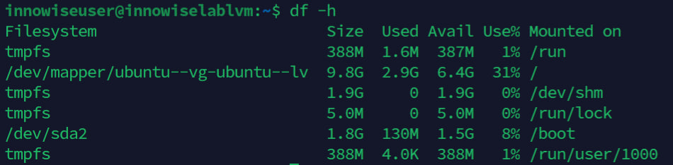

**1.1   Создать каталог ~/test и в нем файл test_123 с любым содержимым. Cоздать символическую ссылку на каталог ~/test по такому пути: /tmp/soft_link. Используя ссылку /tmp/soft_link скопировать файл test_123 в каталог /tmp с тем же именем. Создать жесткую ссылку на файл /tmp/test_123 с именем /tmp/hard_link (вывести общее и использованное количество inodes).**

```bash
mkdir ~/test && echo "symlinks" > ~/test/test_123       # Создаем директорию test, а также файл с содержимым
ln -s ~/test /tmp/soft_link                             # Создаем symlink, мягкую ссылку
cp /tmp/soft_link/test_123 /tmp/                        # копируем файл в папку /tmp/
ln /tmp/test_123 /tmp/hard_link                         # создаем жесткую ссылку
df -i /tmp/                                             # выводим информацию по inodes
```

```bash
Filesystem                        Inodes IUsed  IFree IUse% Mounted on
/dev/mapper/ubuntu--vg-ubuntu--lv 917504 82317 835187    9% /
```

**1.2	Подключить к виртуальной машине новый диск 3ГБ. Создать на нем один раздел размером 2 ГБ. Разметить раздел как xfs. Смонтировать раздел по пути /mnt.Создать любой файл на смонтированной файловой системе. Сделать скриншот/запись вывода команды "df -hT". Увеличить раздел до 3 ГБ. Расширить файловую систему на новое свободное пространство. Убедится, что созданный вами файл остался внутри раздела и файловой системы после всех манипуляций. Вновь ввести команду "df -hT". В чем разница?**

```bash
sudo fdisk /dev/sdb                                     # n - создаем новый диск, primary, default, +2G, w (сохранить изменения)
sudo mkfs.xfs /dev/sdb1                                 # изменяем формат файловой-системы
sudo mount /dev/sdb1 /mnt                               # монтируем
sudo echo "InnowiseLab" > example.txt                   # создаем файл с любым содержимым
df -hT
```

```bash
Filesystem                        Type   Size  Used Avail Use% Mounted on
tmpfs                             tmpfs  791M  1,6M  789M   1% /run
/dev/mapper/ubuntu--vg-ubuntu--lv ext4    14G  3,2G  9,9G  25% /
tmpfs                             tmpfs  3,9G     0  3,9G   0% /dev/shm
tmpfs                             tmpfs  5,0M     0  5,0M   0% /run/lock
/dev/sda2                         ext4   2,0G  130M  1,7G   8% /boot
tmpfs                             tmpfs  791M  4,0K  791M   1% /run/user/1000
tmpfs                             tmpfs  791M  4,0K  791M   1% /run/user/1002
/dev/sdb1                         xfs    2,0G   47M  2,0G   3% /mnt
```
```bash
sudo fdisk /dev/sdb     # удаляем раздел (d), создаем новый (n), primary, default, +3G (поскольку я ставил 5).
```

> Если бы поставил 3 ГБ, можно было просто прожать Enter, после чего w.
<br />

```bash
sudo xfs_growfs /mnt            # расширяем файловую систему на новое свободное пространство
ls /mnt                         # проверяем файл, сам файл и его содержимое на месте
df -hT                          # вывод ниже
```

```bash
Filesystem                        Type   Size  Used Avail Use% Mounted on
tmpfs                             tmpfs  791M  1,6M  789M   1% /run
/dev/mapper/ubuntu--vg-ubuntu--lv ext4    14G  3,2G  9,9G  25% /
tmpfs                             tmpfs  3,9G     0  3,9G   0% /dev/shm
tmpfs                             tmpfs  5,0M     0  5,0M   0% /run/lock
/dev/sda2                         ext4   2,0G  130M  1,7G   8% /boot
tmpfs                             tmpfs  791M  4,0K  791M   1% /run/user/1000
tmpfs                             tmpfs  791M  4,0K  791M   1% /run/user/1002
/dev/sdb1                         xfs    3,0G   54M  3,0G   2% /mnt
```

> Разница в доступном размере. Пересоздали раздел, добавив в нем место до 3 GB, помимо этого расширили файловую систему под новое свободное место. При удалении разделе не отмонтировал его, формат xfs не удалял.

**2.1	Создать новую виртуальную машину. Сделать скриншоты вывода комманд df -h, pvs, lvs, vgs. Подключить 2 новых диска. Создать  новую VG, добавить в него 1 диск; создать 2 LV, распределить доступное пространство между ними поровну. Создать на обоих томах файловую систему xfs. Создать две точки монтирования и смонтировать каждый из томов. Сделать запись/скриншот вывода команды "df -h". Добавить в VG второй оставшийся диск. Расширить первый LV на объем нового диска. Расширить файловую систему на размер нового доступного пространства. Сделать запись/скриншоты вывода комманд "df -h, pvs, lvs, vgs".**

### Скриншот вывода команды df -h: 


### Скриншот вывода команд pvs & lvs: 


### Скриншот вывода команды vgs: 


```bash
sudo fdisk /dev/sdb                                         # n, triple Enter
sudo fdisk /dev/sdc                                         # n, triple Enter
sudo vgcreate innowisevg /dev/sdb1                          # Создаем новую VG с именем `innowisevg` и добавляем туда 1 диск
sudo lvcreate -n innowiselv -l 50%FREE innowisevg           # Создаем 1 LV, пишем 50% доступного.
sudo lvcreate -n innowiselv2 -l 100%FREE innowisevg         # Создаем 2 LV, пишем 100% доступного, поскольку 50% от общего уже занято.
sudo mkfs.xfs /dev/innowisevg/innowiselv                    # Ставим файловую систему, как XFS на 1 LV
sudo mkfs.xfs /dev/innowisevg/innowiselv2                   # Ставим файловую систему, как XFS на 2 LV
sudo mount /dev/innowisevg/innowiselv /mnt/innowiselv       # монтируем
sudo mount /dev/innowisevg/innowiselv2 /mnt/innowiselv2     # монтируем
sudo vgextend innowisevg /dev/sdc1                          # расширяем VG, добавив в него второй диск
sudo lvextend -r -l +100%FREE /dev/innowisevg/innowiselv    # расширяем первый LV на объем нового диска
sudo xfs_growfs /dev/innowisevg/innowiselv                  # расширяем файловую систему на размер нового места
```

### Скриншот вывода команды df -h после выполнения задания:


### Скриншот вывода команды pvs после выполнения задания:


### Скриншот вывода команды lvs после выполнения задания:


### Скриншот вывода команды vgs после выполнения задания:

