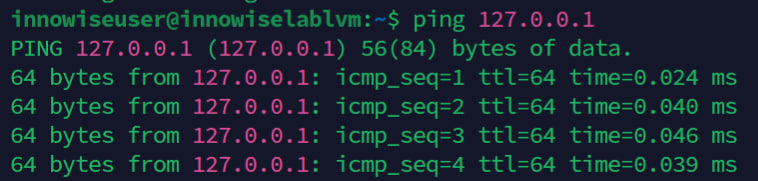
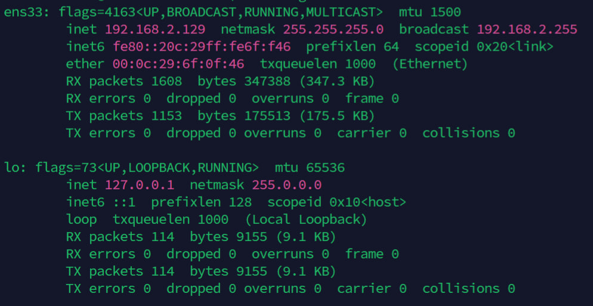

**1.1 Пропиши команду ping 127.0.0.1 Что выводит данная команда? Что за странный набор букв - ttl и icmp?**

```bash
ping 127.0.0.1 # пингуем localhost
```



Как видно из рисунка, это команда ping, которая позволяет посмотреть нам доступность сервера или хоста. TTL (Time To Live) - время жизни пакета или число маршрутизаторов, устройств, через которое он может пройти. icmp_seq = ICMP запрос, нумерует каждый пакет и запрос. time это время дохождения пакета до точки отправления, условный ping. ICMP это протокол, который входит в стек TCP/IP и OSI, можно сказать тестовый. Для устранения неполадок и ошибок, самый простой, обычно всегда и используется в ping.

<br />

**1.2 Пропиши команду ifconfig. Ознакомься с выводом и найди, какой из указанных IP используется, как твой адрес в сети? Почему твоего публичного ip-адреса может не быть в ifconfig?**

```bash
sudo apt install net-tools
ifconfig
```



У меня 192.168.2.129 используется как адрес в сети (в локальной сети), с маской сети 255.255.255.0. Публичного адреса может не быть по многим причинам, например, если маршрутизатор настроен на NAT/PAT, если Innowise использует VPN, а он его использует.

**1.3 Параллельно с первым терминалом, открой второй. Во втором терминале пропиши: ping google.com. В первом терминале пропиши команду tcpdump. Что по-твоему сделала эта команда? Для чего она может быть нужна? Обрати внимание, что выполнять команду нужно с правами суперюзера.**

Первой командой мы пингуем google.com или же его прокси. Второй командой мы захватываем и отслеживаем весь трафик TCP, который происходит в системе. Нам пишет длину пакета, следующий ожидаемые байт, сокеты. Также указывает состояние пакетов ACK, PUSH ACK и т.д.
