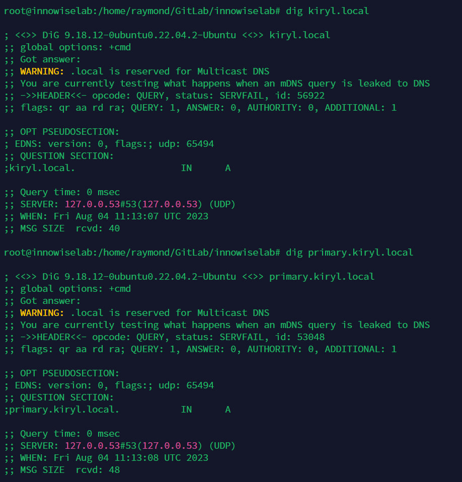
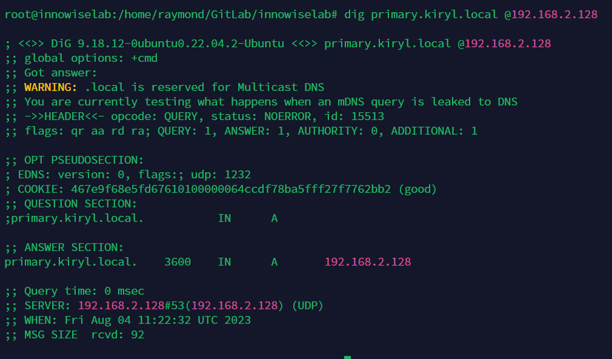
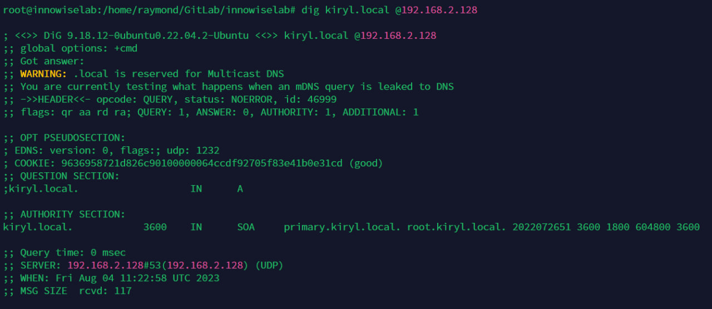
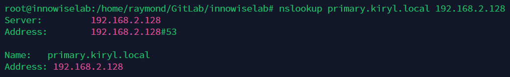

```bash
sudo apt install bind9 -y && sudo apt install dnsutils -y
nano /etc/bind/named.conf
```

Посмотреть содержимое [`named.conf`](conf/named.conf) (без изменений)

```bash
nano /etc/bind/named.conf.local
```

Посмотреть содержимое [`named.conf.local`](conf/named.conf.local) (ниже изменения)

```bash
zone "kiryl.local" IN {
    type master;
    file "/etc/bind/forward.kiryl.local";
    allow-update { none; };
};

zone "2.168.192.in-addr.arpa" IN {
    type master;
    file "/etc/bind/reverse.kiryl.local";
    allow-update { none; };
};
```

Сверху у нас Forward Zone File, снизу Reverse Zone File. Reverse Zone `2.168.192.in-addr.arpa` указывает на адрес зоны, справа-налево, т.е. `192.168.2.0/24`, поскольку адрес сервера `192.168.2.128/24`.

Далее конфигурируем файлы reverse и forward zones. Я их назвал `forward.kiryl.local` и `reverse.kiryl.local`:

```bash
cd /etc/bind/
cp db.local forward.kiryl.local
cp db.127 reverse.kiryl.local
```

Посмотреть содержимое [`forward.kiryl.local`](conf/forward.kiryl.local) (ниже изменения)

```
$TTL 3600
@ IN SOA primary.kiryl.local. root.kiryl.local. (
                        2022072651      ; Serial
                        3600            ; Refresh
                        1800            ; Retry
                        604800          ; Expire
                        3600 )          ; Negative Cache TTL

; Name Server Information
@ IN NS primary.kiryl.local.

; IP address of Your Domain Name Server(DNS)
primary IN A 192.168.2.128
```

Насколько я понял в период настройки - `primary.kiryl.local` это основная зона DNS, которая имеет приоритет, а далее идет почта админа. Ниже `NS` запись и запись `А`

Далее настраиваем reverse.kiryl.local.
Посмотреть содержимое [`reverse.kiryl.local`](conf/reverse.kiryl.local) (ниже изменения)

```bash
$TTL 3600
@ IN SOA primary.kiryl.local. root.kiryl.local. (
                        2022072652      ; Serial
                        3600            ; Refresh
                        1800            ; Retry
                        604800          ; Expire
                        3600 )          ; Negative Cache TTL

; Name Server Information
@ IN NS primary.kiryl.local.

; Reverse DNS for the IP addresses
128 IN PTR primary.kiryl.local.
```

Тут тоже все просто. Что касается второго задания: \
Посмотреть содержимое [`named.conf.optins`](conf/named.conf.optins) (ниже изменения)

```bash
nano /etc/bind/named.conf.optins
```

Было добавлено в конфиг:

```
forwarders {
		192.168.2.128;
	};

```
```
	listen-on { 192.168.2.0/24; };
	allow-query { any; };
```

Далее перезагружаем сервисы:

```bash
systemctl restart named или systemctl restart bind9
```

Разрешаем использование DNS через фаерволл:
`ufw allow bind9` или `ufw allow DNS` или `ufw allow 53`

После чего проверяем через `dig kiryl.local` или `dig primary.kiryl.local`: \
[`Скриншот`](img/digs.jpg)



Изначально я подумал, почему оно не работает и пишет локальный адрес и совсем не то, что я настривал. Но полазив в инете, я понял, что есть дефолтный resolve.conf. Который содержит:

```bash
nameserver 127.0.0.53
options edns0 trust-ad
search localdomain
```

Тогда проверяем другими командами, напрямую обращаясь к DNS-серверу:

```bash
dig primary.kiryl.local @192.168.2.128
dig kiryl.local @192.168.2.128
nslookup primary.kiryl.local 192.168.2.128
```

Вывод `dig primary.kiryl.local @192.168.2.128`:



Вывод `dig kiryl.local @192.168.2.128`:



Вывод `nslookup primary.kiryl.local 192.168.2.128`:




