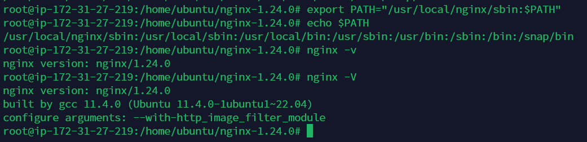

**1. Создать сервер t2.micro(Ubuntu), он должен иметь публичный ip и доступ в интернет. При создании использовать User Data cкрипт(приложен ниже). Разрешить http и https трафик в security group, ассоциированной с данным сервером.**

```bash
#!/bin/bash
sudo apt-get update -y
sudo apt-get install -y nginx
sudo rm -r /var/www/html/index.nginx-debian.html
echo "Welcome to my web server. My private IP is $(curl -s http://169.254.169.254/latest/meta-data/local-ipv4)" | sudo tee /var/www/html/index.nginx-debian.html
sudo systemctl reload nginx
```

Выполнение:
```bash
nano startScript.sh
sh startScript.sh
```

**2. Зарегистрироваться на сайте: Free Dynamic DNS - Managed DNS - Managed Email - Domain Registration - No-IP , разобраться в типах DNS записей, сделать DNS записать типа A для созданного сервера.**

Готово.

**3. Получить сертификат для своего сервера, используя letsencrypt. Разобраться в цепочках сертификатов.**

```bash
sudo apt install certbot -y
sudo apt install certbot python3-certbot-nginx -y
certbot --nginx
```

**4. Установить Nginx на сервер. Написать конфигурацию nginx для обслуживания на 80 и 443 портах. 80 порт должен делать редирект на 443(сайт должен работать только по HTTPS). Веб-сервер должен раздавать /var/www/html/index.nginx-debian.html, который был сгенерирован User Data скриптом.**

Выполнение:
```bash
sudo apt install nginx
cd /etc/nginx/sites-available/
cp default task.conf && rm ../sites-enabled/default
nano task.conf
cd ../sites-enabled/
ln -s /etc/nginx/sites-available/task.conf task.conf
cd ../sites-available/
nginx -s reload
```
Глянуть конфиг: [`task.conf`](cfg/task.conf)

**5. Проверить работоспособность. При вводе домена в поисковую строку должен выдаваться текст: Welcome to my web server. My private IP is X.X.X.X.**

Работает.

**6. В следующих чекпоинтах нужно изменять страницу nginx и конфигурационный файл:** \
**6.1 Клиент нажимает на слово-ссылку, после чего его перенаправляет на html-страницу с картинкой.** \
**6.2 Клиент нажимает на слово-ссылку, по которой можно скачать файл mp3 с музыкой.** \
**6.3 Сделать регулярное выражение для отображения картинок(png, jpg). Если формат jpg, то перевернуть картинку с помощью nginx.** 

Пункты 6.1, 6.2 простые, просто перезагрузки nginx и проверки. Глянуть конфиг: [`task.conf`](cfg/task.conf)

Пункт 6.3:
```bash
sudo apt install build-essential -y && sudo apt install zlib1g-dev libpcre3 libpcre3-dev unzip -y
sudo apt install libgd-dev libgeoip-dev libxslt1-dev libxml2-dev libperl-dev -y
sudo apt install libgd-dev
wget http://nginx.org/download/nginx-1.24.0.tar.gz
tar -zxvf nginx-1.24.0.tar.gz
cd nginx-1.24.0
./configure --with-http_image_filter_module
make
sudo make install
export PATH="/usr/local/nginx/sbin:$PATH"
nginx -v
```

Удалось установить nginx с модулем http_image_filter_module, в конфиге я примерно накидал, может будет работать. Но делал я это на третьем сервере, чтобы не повредить данные.




**7. Создать второй сервер t2.micro, установить Apache и PHP(fpm), взять за основу info.php файл. Настроить Apache на обслуживание данного файла.**

Выполняем:
```bash
sudo apt install php-fpm php-mysql php-gd php-mbstring -y
sudo apt install apache2
cd /var/www/
mkdir php
cd php/
nano info.php
```

Содержимое info.php:
```php
<?php

// Показывать всю информацию, по умолчанию INFO_ALL
phpinfo();

?>
```

Далее: 
```bash
cd /etc/apache2/sites-available/
ls ../sites-enabled/
ls
cp 000-default.conf apache.conf
nano apache.conf 
rm ../sites-enabled/000-default.conf 
cd ../sites-enabled/
ln -s /etc/apache2/sites-available/apache.conf apache.conf
ls
cd ../sites-available/
systemctl restart apache2
sudo a2enmod mpm_event
sudo a2enconf php8.1-fpm
sudo a2enmod proxy
sudo a2enmod proxy_fcgi
sudo apachectl configtest
sudo systemctl restart apache2
systemctl restart apache2
```

Посмотреть конфиг: [`apache.conf`](cfg/apache.conf)

**8. Создать слово-ссылку в html-странице, которая будет перенаправлять запрос с Nginx-cервера на Apache-сервер.**

Тут все просто, сделал так: 
```html
<a href="http://X1.X2.X3.X4">слово</a>
```


# Файлы, которые были созданы

## Индексная страница NGINX:

```html
<!DOCTYPE html>
<html>
<head>
    <title>Задача с чекпоинтами</title>
</head>
<body>
    <p>Welcome to my web server. My private IP is 172.31.20.187</p>
    <h1>Список чекпоинтов:</h1>
    <ol>
        <li>Клиент нажимает на <a href=/image>слово-ссылку</a>, после чего его перенаправляет на html-страницу с картинкой.</li>
        <li>Клиент нажимает на <a href="/download_music" download>слово-ссылку</a>, по которой можно скачать файл mp3 с музыкой.</li>
        <li>Сделать регулярное выражение для отображения картинок (png, jpg). Если формат jpg, то перевернуть картинку с помощью nginx.</li>
        <li>Создать <a href="http://13.49.76.103/">слово-ссылку</a> в html-странице, которая будет перенаправлять запрос с Nginx-cервера на Apache-сервер.</li>
    </ol>
</body>
</html>
```

## Индексная страница apache:

```php
<?php

// Показывать всю информацию, по умолчанию INFO_ALL
phpinfo();

?>
```

## Индексная страница image.html:

```html
<!DOCTYPE html>
<html>
<head>
    <title>Image Page</title>
</head>
<body>
    
</body>
</html>
```

