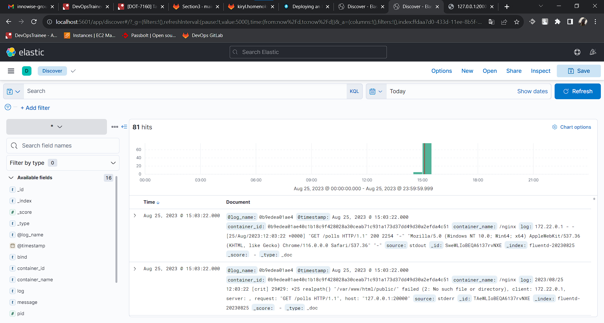
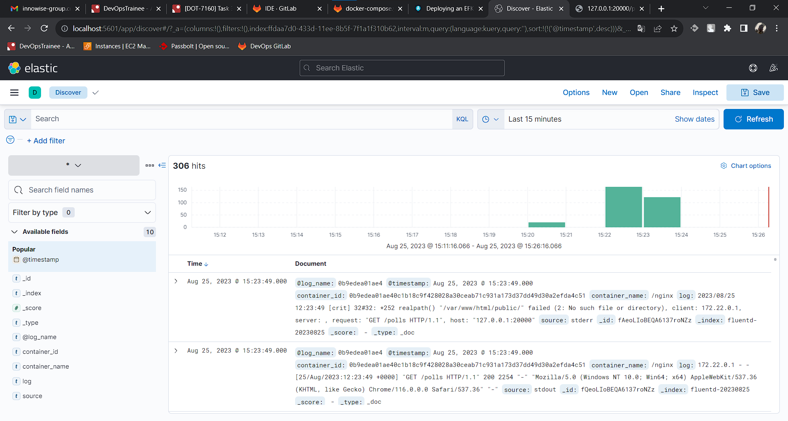

**1. В репозитории из предыдущего задания создайте новую ветку с именем dkr-31-voting-efk.**

Готово.

**2. Измените docker-compose.yml файл, добавив следующее:**
1. добавьте EFK стек;
2. Fluentd должен быть доступен с хоста;
3. Kibana должна быть доступна с хоста;
4. остальные сервисы должны отправлять логи в fluentd через fluentd log driver.

Измененный `docker-compose.yml` можно посмотреть здесь: 
1. [docker-compose.yml](https://devops-gitlab.inno.ws/kiryl.homenok/devops-docker-30-voting/-/blob/dkr-31-voting-efk/docker-compose.yml) (for all services - redis, mysql, voting, nginx, fluentd, elasticsearch, kibana)
2. [fluent.conf](https://devops-gitlab.inno.ws/kiryl.homenok/devops-docker-30-voting/-/blob/dkr-31-voting-efk/fluentd/conf/fluent.conf) (for Fluentd)
3. [entrypoint.sh](https://devops-gitlab.inno.ws/kiryl.homenok/devops-docker-30-voting/-/blob/dkr-31-voting-efk/fluentd/entrypoint.sh) (for Fluentd)
4. [Dockerfile](https://devops-gitlab.inno.ws/kiryl.homenok/devops-docker-30-voting/-/blob/dkr-31-voting-efk/fluentd/Dockerfile) (for Fluentd)

**3. Запустите сервис с именем проекта rbm31.**

```bash
docker-compose -p rbm31 up -d
```

**4. Сконфигурируйте приложение, выполнив команды из раздела Migration и Seeding в README репозитория.**

```bash
docker exec -it voting php artisan migrate --force
# Migration table created successfully.
# Migrating: 2019_08_19_000000_create_failed_jobs_table
# Migrated:  2019_08_19_000000_create_failed_jobs_table (0.06 seconds)
# Migrating: 2019_10_30_103715_create_pool_tables
# Migrated:  2019_10_30_103715_create_pool_tables (0.52 seconds)

docker exec -it voting php artisan db:seed --force
# Seeding: PollsSeeder
# Seeded:  PollsSeeder (102.67 seconds)
# Database seeding completed successfully.
```

**5. Обратитесь к сервису по localhost:20000/polls (вы должны увидеть json-объект).**

```bash
curl localhost:20000/polls
# {"current_page":1,"data":[{"id":1,"question":"Dolorum veniam veniam eaque nulla.","created_at":"2023-08-25 11:45:30","updated_at":"2023-08-25 11:45:30"},{"id":2,"question":"Velit dolorem et consequuntur sapiente hic.","created_at":"2023-08-25 11:45:31","updated_at":"2023-08-25 11:45:31"},{"id":3,"question":"Voluptatem repudiandae aut cumque.","created_at":"2023-08-25 11:45:31","updated_at":"2023-08-25 11:45:31"},{"id":4,"question":"Et officia voluptas tenetur eum.","created_at":"2023-08-25 11:45:31","updated_at":"2023-08-25 11:45:31"},{"id":5,"question":"Quis fugit aut quas et hic est.","created_at":"2023-08-25 11:45:31","updated_at":"2023-08-25 11:45:31"},{"id":6,"question":"Error officiis aliquam quam at assumenda.","created_at":"2023-08-25 11:45:31","updated_at":"2023-08-25 11:45:31"},{"id":7,"question":"Eum expedita qui cum.","created_at":"2023-08-25 11:45:31","updated_at":"2023-08-25 11:45:31"},{"id":8,"question":"Fugit dolorem tempora deleniti ab.","created_at":"2023-08-25 11:45:31","updated_at":"2023-08-25 11:45:31"},{"id":9,"question":"Et nam officia culpa qui dolores nulla.","created_at":"2023-08-25 11:45:31","updated_at":"2023-08-25 11:45:31"},{"id":10,"question":"Architecto commodi ut dolores ut perspiciatis ad.","created_at":"2023-08-25 11:45:31","updated_at":"2023-08-25 11:45:31"},{"id":11,"question":"Veniam similique et a et.","created_at":"2023-08-25 11:45:31","updated_at":"2023-08-25 11:45:31"},{"id":12,"question":"Autem iure eius recusandae quis nesciunt.","created_at":"2023-08-25 11:45:31","updated_at":"2023-08-25 11:45:31"},{"id":13,"question":"Voluptas enim commodi veniam.","created_at":"2023-08-25 11:45:31","updated_at":"2023-08-25 11:45:31"},{"id":14,"question":"Iure neque autem placeat numquam.","created_at":"2023-08-25 11:45:31","updated_at":"2023-08-25 11:45:31"},{"id":15,"question":"At amet occaecati alias consequuntur.","created_at":"2023-08-25 11:45:31","updated_at":"2023-08-25 11:45:31"}],"first_page_url":"http:\/\/localhost:20000\/polls?page=1","from":1,"last_page":7,"last_page_url":"http:\/\/localhost:20000\/polls?page=7","next_page_url":"http:\/\/localhost:20000\/polls?page=2","path":"http:\/\/localhost:20000\/polls","per_page":15,"prev_page_url":null,"to":15,"total":100}
```

**6. Откройте Kibana в браузере и проверьте, что логи запроса присутствуют.**

## Проверяем:



## Запрос отображается, его лог тоже:


## Сделал около 300 запросов, они тоже отображаются:




**7. Загрузите новую ветку с изменениями в репозиторий.**

Готово.

Все контейнеры и образы:

```bash
docker images
# REPOSITORY      TAG       IMAGE ID       CREATED             SIZE
# fluent          own       ac6ed8fa92be   49 minutes ago      56.6MB
# voting          latest    53ab16650e13   About an hour ago   246MB
# redis           latest    506734eb5e71   8 days ago          138MB
# nginx           alpine    eaf194063ee2   9 days ago          42.6MB
# mysql           latest    99afc808f15b   2 weeks ago         577MB
# elasticsearch   7.17.0    6fe993d6e7ed   19 months ago       612MB
# kibana          7.17.0    9c9fdad81115   19 months ago       888MB

docker ps
# CONTAINER ID   IMAGE                  COMMAND                  CREATED          STATUS          PORTS
                                                         NAMES
# 75a2876351d1   nginx:alpine           "/docker-entrypoint.…"   3 seconds ago    Up 2 seconds    0.0.0.0:20000->80/tcp, :::20000->80/tcp
                                                         nginx
# f46a7ab6ff75   voting:latest          "docker-php-entrypoi…"   4 seconds ago    Up 3 seconds    0.0.0.0:9000->9000/tcp, :::9000->9000/tcp                                                                voting
# 8e648c2e6d80   mysql                  "docker-entrypoint.s…"   5 seconds ago    Up 3 seconds    3306/tcp, 33060/tcp
                                                         mysql
# 50ed92a0b76b   redis:latest           "docker-entrypoint.s…"   5 seconds ago    Up 3 seconds    6379/tcp
                                                         redis
# 3ec2b7cc789b   fluent:own             "tini -- /bin/entryp…"   37 seconds ago   Up 36 seconds   5140/tcp, 0.0.0.0:24224->24224/tcp, 0.0.0.0:24224->24224/udp, :::24224->24224/tcp, :::24224->24224/udp   Fluent
# a92441bf82a0   kibana:7.17.0          "/bin/tini -- /usr/l…"   37 seconds ago   Up 36 seconds   0.0.0.0:5601->5601/tcp, :::5601->5601/tcp                                                                Kibana
# 8354a68505f7   elasticsearch:7.17.0   "/bin/tini -- /usr/l…"   38 seconds ago   Up 36 seconds   9200/tcp, 9300/tcp
                                                         ESearch


docker-compose -p rbm31 ps
#  Name                Command               State                                               Ports
# ------------------------------------------------------------------------------------------------------------------------------------------------
# ESearch   /bin/tini -- /usr/local/bi ...   Up      9200/tcp, 9300/tcp
# Fluent    tini -- /bin/entrypoint.sh ...   Up      0.0.0.0:24224->24224/tcp,:::24224->24224/tcp, 0.0.0.0:24224->24224/udp,:::24224->24224/udp,
#                                                   5140/tcp
# Kibana    /bin/tini -- /usr/local/bi ...   Up      0.0.0.0:5601->5601/tcp,:::5601->5601/tcp
# mysql     docker-entrypoint.sh --def ...   Up      3306/tcp, 33060/tcp
# nginx     /docker-entrypoint.sh ngin ...   Up      0.0.0.0:20000->80/tcp,:::20000->80/tcp
# redis     docker-entrypoint.sh redis ...   Up      6379/tcp
# voting    docker-php-entrypoint php-fpm    Up      0.0.0.0:9000->9000/tcp,:::9000->9000/tcp
```
