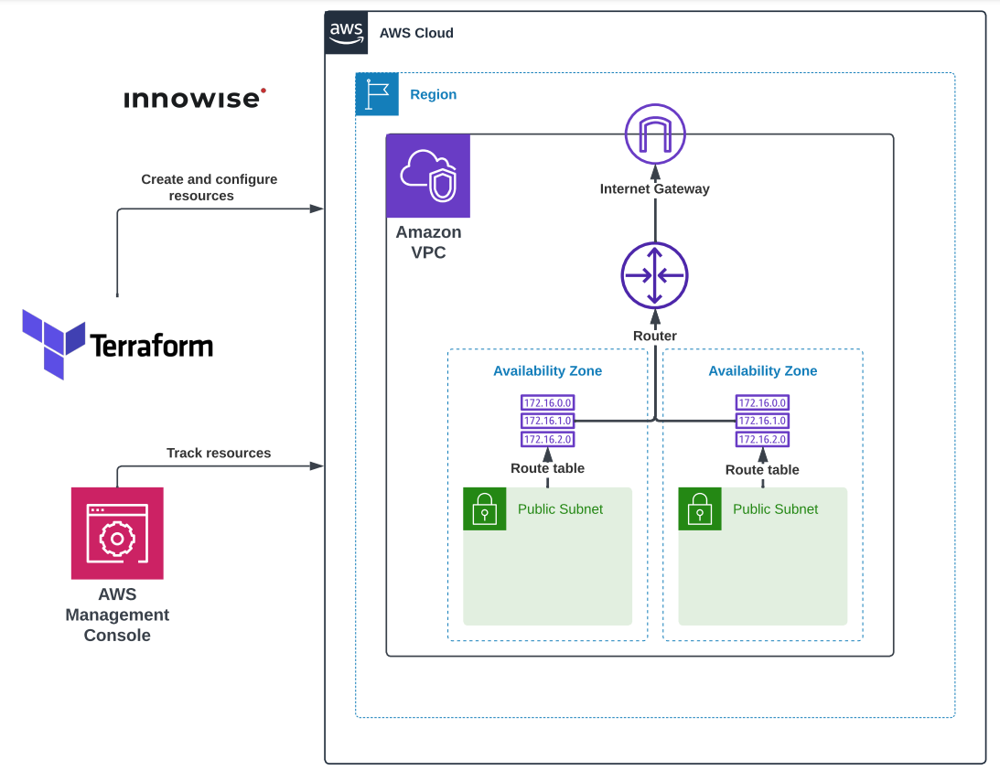

**1. Написать Terraform манифест для создания VPC и Public Subnets согласно схеме.**

## Схема:

<div style="text-align:center;">
  
</div>

---

Реализованные модули:
- [x] 1. Module [aws_internet_gateway](#module-aws_internet_gateway)
- [ ] 2. Module [aws_route](#module-aws_route) (module has been realized, but not used)
- [x] 3. Module [aws_route_table](#module-aws_route_table)
- [x] 4. Module [aws_route_table_association](#module-aws_route_table_association)
- [x] 5. Module [aws_vpc_with_subnets](#module-aws_vpc_with_subnets)


Корневая директория (заголовочный файлы):
- [x] File [main.tf](#files-from-root-directory)
- [ ] File `outputs.tf`
- [ ] File `variables.tf`


## Modules [`(click)`](./files/Task2/modules/)


### Module [`aws_internet_gateway`](./files/Task2/modules/aws_internet_gateway/)

Этот модуль был реализован для создания Internet Gateway и привязывания его к VPC.

<details>
<summary>Просмотреть <b>main.tf</b> модуля <code>aws_internet_gateway</code></summary>

```hcl
# Creating IGW and attach to VPC ID
resource "aws_internet_gateway" "main_igw" {
  vpc_id = var.vpc_id_for_igw

  tags = {
    Name = var.igw_name
  }
}
```

</details>
<br>

<details>
<summary>Просмотреть <b>outputs.tf</b> модуля <code>aws_internet_gateway</code></summary>

```hcl
output "igw_id" {
  value = aws_internet_gateway.main_igw.id
}
```

</details> 
<br>

<details>
<summary>Просмотреть <b>variables.tf</b> модуля <code>aws_internet_gateway</code></summary>

```hcl
variable "vpc_id_for_igw" {
  type    = string
  default = ""
}

variable "igw_name" {
  type    = string
  default = "Null (please set a name)"
}
```

</details>
<br>

### Module [`aws_route`](./files/Task2/modules/aws_route/)

Этот модуль был реализован для создания и добавления маршрутов в Route Table, но не был использован, поскольку по умолчанию Route Table имеет маршрут 172.16.0.0/16, т.е VPC_ADDRESS

<details>
<summary>Просмотреть <b>main.tf</b> модуля <code>aws_route</code></summary>

```hcl
# Creating route and attach to Route Table
resource "aws_route" "add_route" {
  count = length(var.list_of_destinations)

  route_table_id         = var.routetable_id
  gateway_id             = var.gateway_id_for_route
  destination_cidr_block = element(var.list_of_destinations, count.index)
}
```

</details>
<br>

<details>
<summary>Просмотреть <b>variables.tf</b> модуля <code>aws_route</code></summary>

```hcl
variable "routetable_id" {
  type    = string
  default = ""
}

variable "gateway_id_for_route" {
  type    = string
  default = ""
}

variable "list_of_destinations" {
  type = list(string)
}
```

</details>
<br>

### Module [`aws_route_table`](./files/Task2/modules/aws_route_table/)

Этот модуль был создан для создания таблицы маршрутизации, а также привязывания её к Internet Gateway, поскольку сеть Public.

<details>
<summary>Просмотреть <b>main.tf</b> модуля <code>aws_route_table</code></summary>

```hcl
# Creating Route Table
resource "aws_route_table" "route_table" {
  vpc_id = var.vpc_id_for_route_table

  route {
    cidr_block = var.route_table_cidr_block
    gateway_id = var.route_table_igw_id
  }

  tags = {
    Name = var.routetable_name
  }
}
```

</details>
<br>

<details>
<summary>Просмотреть <b>outputs.tf</b> модуля <code>aws_route_table</code></summary>

```hcl
output "route_table_id" {
  value = aws_route_table.route_table.id
}
```

</details> 
<br>

<details>
<summary>Просмотреть <b>variables.tf</b> модуля <code>aws_route_table</code></summary>

```hcl
variable "route_table_cidr_block" {
  type    = string
  default = ""
}

variable "vpc_id_for_route_table" {
  type    = string
  default = ""
}

variable "route_table_igw_id" {
  type    = string
  default = ""
}

variable "routetable_name" {
  type    = string
  default = "Null (please set a name)"
}
```

</details>
<br>

### Module [`aws_route_table_association`](./files/Task2/modules/aws_route_table_association/)

Этот модуль реализован для того, чтобы приатачить (привязать) Route Table к каким-то конкретным сетям, одной или к списку.

<details>
<summary>Просмотреть <b>main.tf</b> модуля <code>aws_route_table_association</code></summary>

```hcl
# Attach Route Table to all subnets
resource "aws_route_table_association" "to_list_of_subnets" {
  count          = length(var.subnet_ids)
  route_table_id = var.route_table_to_attach
  subnet_id      = element(var.subnet_ids, count.index)
}
```

</details>
<br>

<details>
<summary>Просмотреть <b>variables.tf</b> модуля <code>aws_route_table_association</code></summary>

```hcl
variable "route_table_to_attach" {
  type    = string
  default = ""
}

variable "subnet_ids" {
  type    = list(string)
  default = []
}
```

</details>
<br>

### Module [`aws_vpc_with_subnets`](./files/Task2/modules/aws_vpc_with_subnets/)

Этот модуль создает VPC, а также весь список list(string) сетей. Т.е. одна VPC, список сетей, привязывает эти сети к созданной VPC. Максимально удобно.

<details>
<summary>Просмотреть <b>main.tf</b> модуля <code>aws_vpc_with_subnets</code></summary>

```hcl
# Creating main VPC
resource "aws_vpc" "main_vpc" {
  cidr_block = var.vpc_cidr

  tags = {
    Name = var.vpc_name
  }
}

# Creating Subnets in the main VPC
resource "aws_subnet" "creating_subnets" {
  count                   = length(var.public_subnets_cidrs)
  vpc_id                  = aws_vpc.main_vpc.id
  cidr_block              = element(var.public_subnets_cidrs, count.index)
  availability_zone       = element(var.azs, count.index)
  map_public_ip_on_launch = true

  tags = {
    Name = "[VPC: ${aws_vpc.main_vpc.id}] Public Subnet №${count.index + 1}"
  }
}
```

</details>
<br>

<details>
<summary>Просмотреть <b>outputs.tf</b> модуля <code>aws_vpc_with_subnets</code></summary>

```hcl
output "main_vpc_id" {
  value = aws_vpc.main_vpc.id
}

output "vpc_cidr_block" {
  value = aws_vpc.main_vpc.cidr_block
}

output "getlist_of_subnet_ids" {
  value = aws_subnet.creating_subnets[*].id
}
```

</details> 
<br>

<details>
<summary>Просмотреть <b>variables.tf</b> модуля <code>aws_vpc_with_subnets</code></summary>

```hcl
variable "public_subnets_cidrs" {
  type    = list(string)
  default = []
}

variable "azs" {
  type    = list(string)
  default = []
}

variable "vpc_cidr" {
  type    = string
  default = ""
}

variable "vpc_name" {
  type    = string
  default = "Null (please set a name)"
}
```

</details>
<br>

## Files from [`root directory`](./files/Task2/):

### File `main.tf`

<details>
<summary>Просмотреть <b>main.tf</b></summary>

```hcl
provider "aws" {
  region = "eu-north-1"
}

# Creating a VPC and a list of subnets in it
module "aws_vpc_with_subnets" {
  source = "./modules/aws_vpc_with_subnets"

  vpc_cidr             = "172.16.0.0/16"
  public_subnets_cidrs = ["172.16.0.0/24", "172.16.1.0/24", "172.16.2.0/24"]
  azs                  = ["eu-north-1a"]
  vpc_name             = "The main VPC of project"
}

# Creating internet gateway and attach his to VPC
module "aws_igw" {
  source = "./modules/aws_internet_gateway"

  vpc_id_for_igw = module.aws_vpc_with_subnets.main_vpc_id
  igw_name       = "Internet Gateway for main VPC"

  depends_on = [module.aws_vpc_with_subnets]
}

# Creating Route Table and attach her to VPC and IGW
module "aws_route_table" {
  source = "./modules/aws_route_table"

  route_table_cidr_block = "0.0.0.0/0"
  vpc_id_for_route_table = module.aws_vpc_with_subnets.main_vpc_id
  route_table_igw_id     = module.aws_igw.igw_id
  routetable_name        = "Route table for main VPC"

  depends_on = [module.aws_igw]
}

# Module for adding routes to Route Table, but it's not being used.
# Because the default routing path to the VPC network is specified
# in the route table. 

# module "add_routes" {
#   source = "./modules/aws_route"
#
#   routetable_id        = module.aws_route_table.route_table_id
#   gateway_id_for_route = module.aws_igw.igw_id
#   list_of_destinations = ["172.16.1.0/24", "172.16.2.0/24"]
#
#   depends_on = [module.aws_route_table]
# }

# Attach Route Table to subnets
module "attach_table_to_subnets" {
  source = "./modules/aws_route_table_association"

  route_table_to_attach = module.aws_route_table.route_table_id
  subnet_ids            = module.aws_vpc_with_subnets.getlist_of_subnet_ids

  # If you are using the "aws_route" module (add_routes), change the value of "depends_on" to module.add_routes
  depends_on = [module.aws_route_table]
}
```

</details> 
<br>