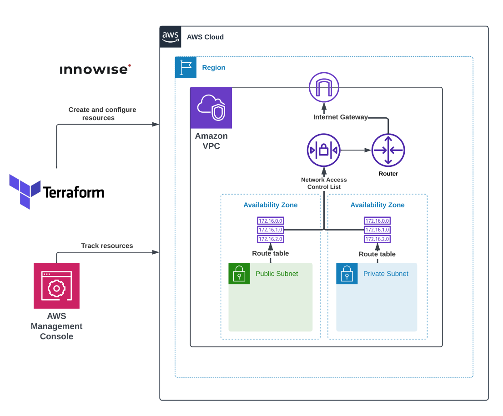

**1. Написать Terraform манифест для создания VPC и Public Subnets согласно схеме.**

## Схема:

<div style="text-align:center;">
  
</div>

---

Реализованные модули:
- [x] 1. Module [nacl](#module-nacl)
- [x] 2. Module [nat-gateway](#module-nat-gateway)
- [x] 3. Module [private-subnets](#module-private-subnets)
- [x] 4. Module [public-subnets](#module-public-subnets)
- [x] 5. Module [vpc](#module-vpc)


Корневая директория (заголовочный файлы):
- [x] File [main.tf](#files-from-root-directory)
- [x] File [outputs.tf](#files-from-root-directory)
- [x] File [variables.tf](#files-from-root-directory)


## Modules folder [`(click)`](./files/Task3/modules/)


### Module [`nacl`](./files/Task3/modules/nacl/)

<details>
<summary>Просмотреть <b>main.tf</b> модуля <code>nacl</code></summary>

```hcl
resource "aws_network_acl" "nacl" {
  vpc_id = var.vpc_id

  tags = merge(var.tags, lookup(var.tags_for_resource, "aws_network_acl", {
    "Name" = "Null"
  }))
}

resource "aws_network_acl_rule" "nacl_rules" {
  count = var.rules_count

  // NACL ID, the variable is needed to avoid creating 
  // a new NACL each time. Allows you to attach rules 
  // to an already created NACL
  network_acl_id = var.network_acl_id

  rule_number = element(var.rule_number, count.index) // Rule number of NACL.     List(string)
  egress      = element(var.egress, count.index)      // Egress: true/false.      List(bool)
  protocol    = element(var.protocol, count.index)    // Protocol: tcp/udp/-1.    List(string)
  rule_action = element(var.rule_action, count.index) // Rule Action: allow/deny. List(string)
  cidr_block  = element(var.cidr_block, count.index)  // CIDR Block: A.B.C.D/E.   List(string)
  from_port   = element(var.from_port, count.index)   // From Port: 0-65535.      List(string)
  to_port     = element(var.to_port, count.index)     // To Port: 0-65535.        List(string)
}

resource "aws_network_acl_association" "nacl" {
  count = length(var.subnetid_associate)

  network_acl_id = var.network_acl_id
  subnet_id      = element(var.subnetid_associate, count.index)
}
```

</details>
<br>

<details>
<summary>Просмотреть <b>outputs.tf</b> модуля <code>nacl</code></summary>

```hcl
output "nacl_id" {
  value = aws_network_acl.nacl.id
}
```

</details> 
<br>

<details>
<summary>Просмотреть <b>variables.tf</b> модуля <code>nacl</code></summary>

```hcl
variable "rules_count" {
  type    = string
  default = ""
}

variable "network_acl_id" {
  type    = string
  default = ""
}

variable "vpc_id" {
  type    = string
  default = ""
}

variable "rule_number" {
  type    = list(string)
  default = []
}

variable "protocol" {
  type    = list(string)
  default = []
}

variable "rule_action" {
  type    = list(string)
  default = []
}

variable "cidr_block" {
  type    = list(string)
  default = []
}

variable "from_port" {
  type    = list(string)
  default = []
}

variable "to_port" {
  type    = list(string)
  default = []
}

variable "egress" {
  type    = list(bool)
  default = []
}

variable "subnetid_associate" {
  type    = list(string)
  default = []
}

variable "tags" {
  description = "A map of tags to assign to resources"
  type        = map(string)
  default     = {}
}

variable "tags_for_resource" {
  description = "A nested map of tags to assign to specific resource types"
  type        = map(map(string))
  default     = {}
}
```

</details>
<br>

### Module [`nat-gateway`](./files/Task3/modules/nat-gateway/)

<details>
<summary>Просмотреть <b>main.tf</b> модуля <code>nat-gateway</code></summary>

```hcl
resource "aws_nat_gateway" "natgw" {
  count = var.subnet_count

  connectivity_type = "private"
  # allocation_id = element(aws_eip.natgw.*.id, count.index) // only for public ?
  subnet_id = element(var.subnet_ids, count.index)
  tags      = merge(var.tags, lookup(var.tags_for_resource, "aws_nat_gateway", {}))
}
```

</details>
<br>

<details>
<summary>Просмотреть <b>outputs.tf</b> модуля <code>nat-gateway</code></summary>

```hcl
output "get_nat_gateway_count" {
  description = "The number of gateways"
  value       = var.subnet_count
}

output "get_nat_gateway_ids" {
  description = "List of gateway IDs"
  value       = aws_nat_gateway.natgw.*.id
}

#output "get_nat_gateway_public_ips" {
#  description = "List of public IPs belonging to the Nat Gateways"
#  value       = aws_eip.natgw.*.public_ip
#}
```

</details>
<br>

<details>
<summary>Просмотреть <b>variables.tf</b> модуля <code>nat-gateway</code></summary>

```hcl
variable "subnet_count" {
  description = "The number of subnets to create gateways in, must match length of subnet_ids"
  type        = string
}

variable "subnet_ids" {
  description = "A list of subnets to create gateways in"
  type        = list(string)
}

variable "tags" {
  description = "A map of tags to assign to resources"
  type        = map(string)
  default     = {}
}

variable "tags_for_resource" {
  description = "A nested map of tags to assign to specific resource types"
  type        = map(map(string))
  default     = {}
}
```

</details>
<br>

### Module [`private-subnets`](./files/Task3/modules/private-subnets/)

<details>
<summary>Просмотреть <b>main.tf</b> модуля <code>private-subnets</code></summary>

```hcl
resource "aws_subnet" "private_subnet" {
  count = var.subnet_count

  vpc_id            = var.vpc_id
  cidr_block        = element(var.cidr_block, count.index)
  availability_zone = var.availability_zone

  tags = merge(var.tags, lookup(var.tags_for_resource, "aws_private_subnet",
    {
      "Name"        = "Private Subnet #${count.index + 1}"
      "Description" = "Terraform Task 3"
  }))
}

resource "aws_route_table" "private_subnet_route_table" {
  # count = var.subnet_count
  vpc_id = var.vpc_id

  tags = merge(var.tags, lookup(var.tags_for_resource,
    "aws_private_subnet_route_table",
    {
      "Name"        = "Route table of Private Subnets"
      "Description" = "Route Table without IGW & NAT for Private Subnet"
      "Section"     = "Terraform"
      "Task"        = "3"
  }))
}

resource "aws_route_table_association" "default" {
  count = var.subnet_count

  subnet_id      = element(aws_subnet.private_subnet.*.id, count.index)
  route_table_id = aws_route_table.private_subnet_route_table.id

  # For each subnet creating route table
  # route_table_id = element(aws_route_table.private_subnet_route_table.*.id, count.index)
}


# For NAT gateway
/* 
resource "aws_route" "nat_gateway" {
  count = var.nat_gateway_count

  destination_cidr_block = "0.0.0.0/0"
  route_table_id         = element(module.subnets.get_route_table_ids, count.index)
  nat_gateway_id         = element(var.nat_gateway_ids, count.index)
} */
```

</details>
<br>

<details>
<summary>Просмотреть <b>outputs.tf</b> модуля <code>private-subnets</code></summary>

```hcl
output "get_subnet_count" {
  description = "The number of subnets"
  value       = var.subnet_count
}

output "get_subnet_ids" {
  description = "List of subnet IDs"
  value       = aws_subnet.private_subnet.*.id
}

output "get_route_table_ids" {
  description = "List of route table IDs"
  value       = aws_route_table.private_subnet_route_table.id
}
```

</details> 
<br>

<details>
<summary>Просмотреть <b>variables.tf</b> модуля <code>private-subnets</code></summary>

```hcl
# Standard subnet variables

variable "vpc_id" {
  description = "The ID of the VPC to create the subnets in"
  type        = string
}

variable "cidr_block" {
  description = "The CIDR blocks for private subnets"
  type        = list(string)
  default     = [""]
}

variable "subnet_count" {
  description = "The number of subnets to create"
  type        = string
}

variable "availability_zone" {
  description = "A list of availability zones to create the subnets in"
  type        = string
}

variable "tags" {
  description = "A map of tags to assign to resources"
  type        = map(string)
  default     = {}
}

variable "tags_for_resource" {
  description = "A nested map of tags to assign to specific resource types"
  type        = map(map(string))
  default     = {}
}

# Private subnet variables

variable "nat_gateway_count" {
  description = "The number of NAT gateways to use for routing, must match subnet_count and nat_gateway_ids"
  default     = 0
}

variable "nat_gateway_ids" {
  description = "A list of NAT Gateway IDs to use for routing"
  default     = []
}
```

</details>
<br>

### Module [`public-subnets`](./files/Task3/modules/public-subnets/)

Этот модуль реализован для того, чтобы приатачить (привязать) Route Table к каким-то конкретным сетям, одной или к списку.

<details>
<summary>Просмотреть <b>main.tf</b> модуля <code>public-subnets</code></summary>

```hcl
resource "aws_subnet" "public_subnet" {
  count = var.subnet_count

  vpc_id                  = var.vpc_id
  cidr_block              = element(var.cidr_block, count.index)
  availability_zone       = var.availability_zone
  map_public_ip_on_launch = var.map_public_ip_on_launch

  tags = merge(var.tags, lookup(var.tags_for_resource, "aws_public_subnet",
    {
      "Name"        = "Public Subnet #${count.index + 1}"
      "Description" = "Public Subnet"
      "Section"     = "Terraform"
      "Task"        = "3"
  }))
}

resource "aws_route_table" "public_subnet_route_table" {
  # count = var.subnet_count

  vpc_id = var.vpc_id

  tags = merge(var.tags, lookup(var.tags_for_resource,
    "aws_public_subnet_route_table",
    {
      "Name"        = "Route table of Public Subnets"
      "Description" = "Route Table with IGW for Public Subnet"
      "Section"     = "Terraform"
      "Task"        = "3"
  }))
}

resource "aws_route" "internet_gateway" {
  count = var.subnet_count

  destination_cidr_block = "0.0.0.0/0"
  route_table_id         = element(aws_route_table.public_subnet_route_table.*.id, count.index)
  gateway_id             = var.gateway_id
}

resource "aws_route_table_association" "default" {
  count = var.subnet_count

  subnet_id      = element(aws_subnet.public_subnet.*.id, count.index)
  route_table_id = aws_route_table.public_subnet_route_table.id
  # For each subnet creating route table
  # route_table_id = element(aws_route_table.public_subnet_route_table.*.id, count.index)
}
```

</details>
<br>

<details>
<summary>Просмотреть <b>outputs.tf</b> модуля <code>public-subnets</code></summary>

```hcl
output "get_subnet_count" {
  description = "The number of subnets"
  value       = var.subnet_count
}

output "get_subnet_ids" {
  description = "List of subnet IDs"
  value       = aws_subnet.public_subnet.*.id
}

output "get_route_table_ids" {
  description = "List of route table IDs"
  value       = aws_route_table.public_subnet_route_table.*.id
}
```

</details>
<br>

<details>
<summary>Просмотреть <b>variables.tf</b> модуля <code>public-subnets</code></summary>

```hcl
# Default Subnet variables

variable "vpc_id" {
  description = "The ID of the VPC to create the subnets in"
  type        = string
}

variable "cidr_block" {
  description = "The CIDR blocks for public subnets"
  type        = list(string)
  default     = [""]
}

variable "subnet_count" {
  description = "The number of subnets to create"
  type        = string
}

variable "availability_zone" {
  description = "A name of availability zone"
  type        = string
}

variable "tags" {
  description = "A map of tags to assign to resources"
  type        = map(string)
  default     = {}
}

variable "tags_for_resource" {
  description = "A nested map of tags to assign to specific resource types"
  type        = map(map(string))
  default     = {}
}

# Public Subnet variables

variable "map_public_ip_on_launch" {
  description = "Assign a public IP address to instances launched into these subnets"
  type        = string
  default     = false
}

variable "gateway_id" {
  description = "The ID of the Internet Gateway to use for routing"
  type        = string
}
```

</details>
<br>

### Module [`vpc`](./files/Task3/modules/vpc/)

<details>
<summary>Просмотреть <b>main.tf</b> модуля <code>vpc</code></summary>

```hcl
resource "aws_vpc" "vpc" {
  cidr_block = var.cidr_block
  tags       = merge(var.tags, lookup(var.tags_for_resource, "aws_vpc", {}))
}

resource "aws_default_route_table" "vpc" {
  default_route_table_id = aws_vpc.vpc.default_route_table_id
  tags                   = merge(var.tags, lookup(var.tags_for_resource, "aws_default_route_table", {}))
}

resource "aws_internet_gateway" "igw" {
  vpc_id = aws_vpc.vpc.id
  tags   = merge(var.tags, lookup(var.tags_for_resource, "aws_internet_gateway", {}))
}
```

</details>
<br>

<details>
<summary>Просмотреть <b>outputs.tf</b> модуля <code>vpc</code></summary>

```hcl
output "get_vpc_id" {
  description = "The VPC ID"
  value       = aws_vpc.vpc.id
}

output "get_vpc_cidr_block" {
  description = "The CIDR block of the VPC"
  value       = aws_vpc.vpc.cidr_block
}

output "get_internet_gateway_id" {
  description = "The Internet Gateway ID"
  value       = aws_internet_gateway.igw.id
}
```

</details> 
<br>

<details>
<summary>Просмотреть <b>variables.tf</b> модуля <code>vpc</code></summary>

```hcl
variable "cidr_block" {
  description = "The CIDR block for the VPC"
  type        = string
}

variable "tags" {
  description = "A map of tags to assign to resources"
  type        = map(string)
  default     = {}
}

variable "tags_for_resource" {
  description = "A nested map of tags to assign to specific resource types"
  type        = map(map(string))
  default     = {}
}
```

</details>
<br>

## Files from [`root directory`](./files/Task3/):

### File `main.tf`

<details>
<summary>Просмотреть <b>main.tf</b></summary>

```hcl
provider "aws" {
  region = "eu-north-1"
}

module "vpc" {
  source = "./modules/vpc"

  cidr_block = var.vpc_cidr_block

  tags              = var.tags
  tags_for_resource = var.tags_for_resource
}

module "public_subnets" {
  source = "./modules/public-subnets"

  vpc_id                  = module.vpc.get_vpc_id
  gateway_id              = module.vpc.get_internet_gateway_id
  map_public_ip_on_launch = var.map_public_ip_on_launch

  cidr_block        = var.public_cidr_block
  subnet_count      = var.public_subnet_count
  availability_zone = "eu-north-1a"

  tags              = var.tags
  tags_for_resource = var.tags_for_resource
}

module "private_subnets" {
  source = "./modules/private-subnets"

  vpc_id = module.vpc.get_vpc_id

  cidr_block        = var.private_cidr_block
  subnet_count      = var.private_subnet_count
  availability_zone = "eu-north-1b"

  tags              = var.tags
  tags_for_resource = var.tags_for_resource
}

#module "nat_gateways" {
#  source = "./modules/nat-gateway"
#
#  subnet_count = module.private_subnets.get_subnet_count
#  subnet_ids   = module.private_subnets.get_subnet_ids
#
#  tags              = var.tags
#  tags_for_resource = var.tags_for_resource
#}

module "nacl" {
  source = "./modules/nacl"

  vpc_id = module.vpc.get_vpc_id

  rules_count = 5

  network_acl_id = module.nacl.nacl_id

  rule_number = lookup(var.nacl_variables, "rule_number", []) // List(string)
  egress      = lookup(var.nacl_variables, "egress", [])      // List(bool)
  rule_action = lookup(var.nacl_variables, "rule_action", []) // List(string)
  protocol    = lookup(var.nacl_variables, "protocol", [])    // List(string)
  from_port   = lookup(var.nacl_variables, "from_port", [])   // List(string)
  to_port     = lookup(var.nacl_variables, "to_port", [])     // List(string)
  cidr_block  = lookup(var.nacl_variables, "cidr_block", [])  // List(string)

  subnetid_associate = concat(module.private_subnets.get_subnet_ids, module.public_subnets.get_subnet_ids)

  tags              = var.tags
  tags_for_resource = var.tags_for_resource
}
```

</details> 
<br>

<details>
<summary>Просмотреть <b>outputs.tf</b></summary>

```hcl
# VPC outputs

output "vpc_id" {
  description = "The VPC ID"
  value       = module.vpc.get_vpc_id
}

output "internet_gateway_id" {
  description = "The Internet Gateway ID"
  value       = module.vpc.get_internet_gateway_id
}

# Public subnet outputs

output "public_subnet_count" {
  description = "The number of public subnets"
  value       = module.public_subnets.get_subnet_count
}

output "public_subnet_ids" {
  description = "List of public subnet IDs"
  value       = module.public_subnets.get_subnet_ids
}

output "public_route_table_ids" {
  description = "List of public route table IDs"
  value       = module.public_subnets.get_route_table_ids
}

# Private subnet outputs

output "private_subnet_count" {
  description = "The number of private subnets"
  value       = module.private_subnets.get_subnet_count
}

output "private_subnet_ids" {
  description = "List of private subnet IDs"
  value       = module.private_subnets.get_subnet_ids
}

output "private_route_table_ids" {
  description = "List of public route table IDs"
  value       = module.private_subnets.get_route_table_ids
}
```

</details> 
<br>

<details>
<summary>Просмотреть <b>variables.tf</b></summary>

```hcl
# Generic variables

variable "tags" {
  description = "A map of tags to assign to resources"
  type        = map(string)
  default     = {}
}

variable "tags_for_resource" {
  description = "A nested map of tags to assign to specific resource types"
  type        = map(map(string))
  default = {
    aws_vpc = {
      "Name"        = "The main VPC"
      "Description" = "Primary VPC for task"
      "Section"     = "Terraform"
      "Task"        = "3"
    },
    aws_network_acl = {
      "Name"        = "The main NACL to filter traffic in subnets"
      "Description" = "Network Access Control List which allows 80,443 (inbound, outbound) on Public Subnet & inbound (49152 - 65535) sockets ports. All other - deny."
      "Section"     = "Terraform"
      "Task"        = "3"
    }
  }
}

# VPC variables

variable "vpc_cidr_block" {
  description = "The CIDR block for the VPC"
  type        = string
  default     = "172.16.0.0/16"
}

# Public subnet variables

variable "public_cidr_block" {
  description = "The larger CIDR block to use for calculating individual public subnet CIDR blocks"
  type        = list(string)
  default     = ["172.16.0.0/24", "172.16.1.0/24", "172.16.2.0/24"]
}

variable "public_subnet_count" {
  description = "The number of public subnets to create"
  type        = string
  default     = "3"
}

variable "map_public_ip_on_launch" {
  description = "Assign a public IP address to instances launched into the public subnets"
  type        = string
  default     = true
}

# Private subnet variables

variable "private_cidr_block" {
  description = "The larger CIDR block to use for calculating individual private subnet CIDR blocks"
  type        = list(string)
  default     = ["172.16.3.0/24", "172.16.4.0/24", "172.16.5.0/24"]
}

variable "private_subnet_count" {
  description = "The number of private subnets to create"
  type        = string
  default     = "3"
}

variable "nacl_variables" {
  type = map(list(string))
  default = {
    rule_number = ["100", "110", "120", "130", "140"],
    egress      = ["false", "false", "true", "true", "false"],
    rule_action = ["allow", "allow", "allow", "allow", "allow"],
    protocol    = ["tcp", "tcp", "tcp", "tcp", "tcp"],
    from_port   = ["80", "443", "80", "443", "49152"],
    to_port     = ["80", "443", "80", "443", "65535"],
    cidr_block  = ["0.0.0.0/0", "0.0.0.0/0", "0.0.0.0/0", "0.0.0.0/0", "0.0.0.0/0"]
  }
}
```

</details> 
<br>