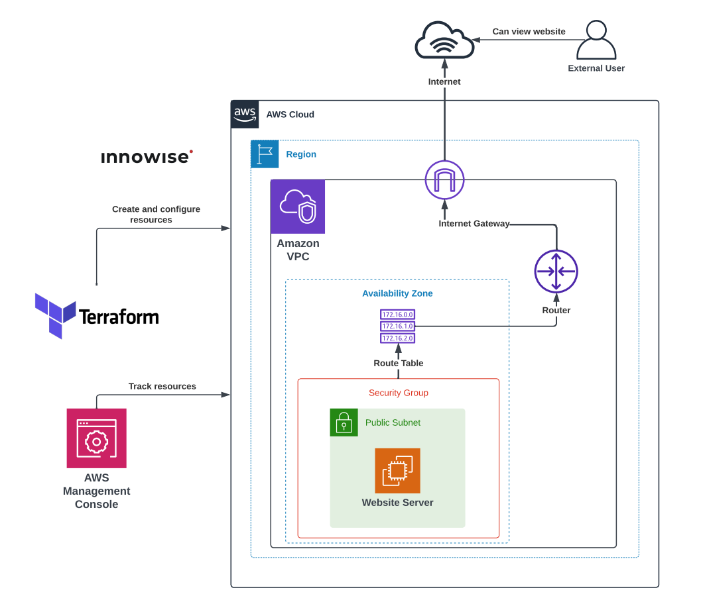

**1. Написать Terraform манифест для создания VPC и Public Subnets согласно схеме.**

## Схема:

<div style="text-align:center;">
  
</div>

---

Реализованные модули:
- [x] 1. Module [instance](#module-instance)
- [x] 2. Module [public-subnets](#module-public-subnets)
- [x] 3. Module [security-group](#module-security-group)
- [x] 4. Module [vpc](#module-vpc)

Корневая директория (заголовочный файлы):
- [x] File [main.tf](#files-from-root-directory)
- [x] File [outputs.tf](#files-from-root-directory)
- [x] File [variables.tf](#files-from-root-directory)

User Data для модуля instance:
- [x] File [user_data.sh](#files-from-user-data)


## Modules folder [`(click)`](./files/Task4/modules/)


### Module [`instance`](./files/Task4/modules/instance/)

<details>
<summary>Просмотреть <b>main.tf</b> модуля <code>instance</code></summary>

```hcl
data "aws_ami" "latest_ubuntu" {
  most_recent = true

  filter {
    name   = "name"
    values = ["ubuntu/images/hvm-ssd/ubuntu-jammy-22.04-amd64-server-*"]
  }

  owners = ["099720109477"]
}

resource "aws_eip" "web-srv-eip" {
  count = var.instance_count

  instance = element(aws_instance.instance_of_web_server.*.id, count.index)
  domain   = "vpc"
}

resource "aws_instance" "instance_of_web_server" {
  count = var.instance_count

  ami                         = data.aws_ami.latest_ubuntu.id
  associate_public_ip_address = true
  instance_type               = var.instance_type
  vpc_security_group_ids      = var.vpc_security_group_ids
  subnet_id                   = element(var.subnet_id, count.index)
  user_data                   = var.userdata_file
  user_data_replace_on_change = true

  lifecycle {
    create_before_destroy = true
  }

  tags = merge(var.tags, lookup(var.tags_for_resource, "aws_web_instance", {}))
}
```

</details>
<br>

<details>
<summary>Просмотреть <b>outputs.tf</b> модуля <code>instance</code></summary>

```hcl
output "instance_ids" {
  value = aws_instance.instance_of_web_server.*.id
}
```

</details> 
<br>

<details>
<summary>Просмотреть <b>variables.tf</b> модуля <code>instance</code></summary>

```hcl
# Generic variables

variable "tags" {
  description = "A map of tags to assign to resources"
  type        = map(string)
  default     = {}
}

variable "tags_for_resource" {
  description = "A nested map of tags to assign to specific resource types"
  type        = map(map(string))
  default = {
    aws_web_instance = {
      "Name"        = "Instance of Web-Server"
      "Description" = "Created using the Instance module"
      "Section"     = "Terraform"
      "Task"        = "4"
    }
  }
}

# Instance variables

variable "instance_count" {
  type    = string
  default = ""
}

variable "instance_type" {
  type    = string
  default = ""
}

variable "subnet_id" {
  type    = list(string)
  default = []
}

variable "userdata_file" {
  type    = string
  default = ""
}

variable "vpc_security_group_ids" {
  type    = list(string)
  default = [""]
}
```

</details>
<br>

### Module [`public-subnets`](./files/Task4/modules/public-subnets/)

<details>
<summary>Просмотреть <b>main.tf</b> модуля <code>public-subnets</code></summary>

```hcl
resource "aws_subnet" "public_subnet" {
  count = var.subnet_count

  vpc_id                  = var.vpc_id
  cidr_block              = element(var.cidr_block, count.index)
  availability_zone       = var.availability_zone
  map_public_ip_on_launch = var.map_public_ip_on_launch

  tags = merge(var.tags, lookup(var.tags_for_resource, "aws_public_subnet",
    {
      "Name"        = "Public Subnet #${count.index + 1}"
      "Description" = "Public Subnet"
      "Section"     = "Terraform"
      "Task"        = "3"
  }))
}

resource "aws_route_table" "public_subnet_route_table" {
  # count = var.subnet_count

  vpc_id = var.vpc_id

  tags = merge(var.tags, lookup(var.tags_for_resource,
    "aws_public_subnet_route_table",
    {
      "Name"        = "Route table of Public Subnets"
      "Description" = "Route Table with IGW for Public Subnet"
      "Section"     = "Terraform"
      "Task"        = "3"
  }))
}

resource "aws_route" "internet_gateway" {
  count = var.subnet_count

  destination_cidr_block = "0.0.0.0/0"
  route_table_id         = element(aws_route_table.public_subnet_route_table.*.id, count.index)
  gateway_id             = var.gateway_id
}

resource "aws_route_table_association" "default" {
  count = var.subnet_count

  subnet_id      = element(aws_subnet.public_subnet.*.id, count.index)
  route_table_id = aws_route_table.public_subnet_route_table.id
  # For each subnet creating route table
  # route_table_id = element(aws_route_table.public_subnet_route_table.*.id, count.index)
}
```

</details>
<br>

<details>
<summary>Просмотреть <b>outputs.tf</b> модуля <code>public-subnets</code></summary>

```hcl
output "get_subnet_count" {
  description = "The number of subnets"
  value       = var.subnet_count
}

output "get_subnet_ids" {
  description = "List of subnet IDs"
  value       = aws_subnet.public_subnet.*.id
}

output "get_route_table_ids" {
  description = "List of route table IDs"
  value       = aws_route_table.public_subnet_route_table.*.id
}
```

</details>
<br>

<details>
<summary>Просмотреть <b>variables.tf</b> модуля <code>public-subnets</code></summary>

```hcl
# Default Subnet variables

variable "vpc_id" {
  description = "The ID of the VPC to create the subnets in"
  type        = string
}

variable "cidr_block" {
  description = "The CIDR blocks for public subnets"
  type        = list(string)
  default     = [""]
}

variable "subnet_count" {
  description = "The number of subnets to create"
  type        = string
}

variable "availability_zone" {
  description = "A name of availability zone"
  type        = string
}

variable "tags" {
  description = "A map of tags to assign to resources"
  type        = map(string)
  default     = {}
}

variable "tags_for_resource" {
  description = "A nested map of tags to assign to specific resource types"
  type        = map(map(string))
  default     = {}
}

# Public Subnet variables

variable "map_public_ip_on_launch" {
  description = "Assign a public IP address to instances launched into these subnets"
  type        = string
  default     = false
}

variable "gateway_id" {
  description = "The ID of the Internet Gateway to use for routing"
  type        = string
}
```

</details>
<br>

### Module [`security-group`](./files/Task4/modules/security-group/)

<details>
<summary>Просмотреть <b>main.tf</b> модуля <code>security-group</code></summary>

```hcl
resource "aws_security_group" "sg" {
  vpc_id = var.vpc_id

  dynamic "ingress" {
    for_each = var.dynamic_ingress
    content {
      from_port   = ingress.value
      to_port     = ingress.value
      protocol    = "tcp"
      cidr_blocks = ["0.0.0.0/0"]
    }
  }

  egress {
    from_port   = 0
    to_port     = 0
    protocol    = "-1"
    cidr_blocks = ["0.0.0.0/0"]
  }

  tags = merge(var.tags, lookup(var.tags_for_resource, "aws_sg", {}))
}
```

</details>
<br>

<details>
<summary>Просмотреть <b>outputs.tf</b> модуля <code>security-group</code></summary>

```hcl
output "sg_id" {
  value = aws_security_group.sg.*.id
}
```

</details> 
<br>

<details>
<summary>Просмотреть <b>variables.tf</b> модуля <code>security-group</code></summary>

```hcl
# Generic variables

variable "tags" {
  description = "A map of tags to assign to resources"
  type        = map(string)
  default     = {}
}

variable "tags_for_resource" {
  description = "A nested map of tags to assign to specific resource types"
  type        = map(map(string))
  default = {
    aws_sg = {
      "Name"        = "Security group for Static Web-Server"
      "Description" = "Created using the security-group module"
      "Section"     = "Terraform"
      "Task"        = "4"
    }
  }
}

# SG variables

variable "dynamic_ingress" {
  type    = list(string)
  default = []
}

variable "vpc_id" {
  type    = string
  default = ""
}
```

</details>
<br>

### Module [`vpc`](./files/Task4/modules/vpc/)

<details>
<summary>Просмотреть <b>main.tf</b> модуля <code>vpc</code></summary>

```hcl
resource "aws_vpc" "vpc" {
  cidr_block = var.cidr_block
  tags       = merge(var.tags, lookup(var.tags_for_resource, "aws_vpc", {}))
}

resource "aws_default_route_table" "vpc" {
  default_route_table_id = aws_vpc.vpc.default_route_table_id
  tags                   = merge(var.tags, lookup(var.tags_for_resource, "aws_default_route_table", {}))
}

resource "aws_internet_gateway" "igw" {
  vpc_id = aws_vpc.vpc.id
  tags   = merge(var.tags, lookup(var.tags_for_resource, "aws_internet_gateway", {}))
}
```

</details>
<br>

<details>
<summary>Просмотреть <b>outputs.tf</b> модуля <code>vpc</code></summary>

```hcl
output "get_vpc_id" {
  description = "The VPC ID"
  value       = aws_vpc.vpc.id
}

output "get_vpc_cidr_block" {
  description = "The CIDR block of the VPC"
  value       = aws_vpc.vpc.cidr_block
}

output "get_internet_gateway_id" {
  description = "The Internet Gateway ID"
  value       = aws_internet_gateway.igw.id
}
```

</details>
<br>

<details>
<summary>Просмотреть <b>variables.tf</b> модуля <code>vpc</code></summary>

```hcl
variable "cidr_block" {
  description = "The CIDR block for the VPC"
  type        = string
}

variable "tags" {
  description = "A map of tags to assign to resources"
  type        = map(string)
  default     = {}
}

variable "tags_for_resource" {
  description = "A nested map of tags to assign to specific resource types"
  type        = map(map(string))
  default     = {}
}
```

</details>
<br>

## Files from [`root directory`](./files/Task4/):

### File `main.tf`

<details>
<summary>Просмотреть <b>main.tf</b></summary>

```hcl
provider "aws" {
  region = "eu-north-1"
}

module "vpc" {
  source = "./modules/vpc"

  cidr_block = var.vpc_cidr_block

  tags              = var.tags
  tags_for_resource = var.tags_for_resource
}

module "public_subnets" {
  source = "./modules/public-subnets"

  vpc_id                  = module.vpc.get_vpc_id
  gateway_id              = module.vpc.get_internet_gateway_id
  map_public_ip_on_launch = var.map_public_ip_on_launch

  cidr_block        = var.public_cidr_block
  subnet_count      = var.public_subnet_count
  availability_zone = "eu-north-1a"

  tags              = var.tags
  tags_for_resource = var.tags_for_resource
}

module "sg" {
  vpc_id = module.vpc.get_vpc_id

  source = "./modules/security-group"

  dynamic_ingress = ["22", "80", "443"]
}

module "instance" {
  source = "./modules/instance"

  instance_count         = 1
  instance_type          = "t3.micro"
  subnet_id              = module.public_subnets.get_subnet_ids
  vpc_security_group_ids = module.sg.sg_id

  userdata_file = filebase64("./user_data/web/user_data.sh")
}
```

</details> 
<br>

<details>
<summary>Просмотреть <b>outputs.tf</b></summary>

```hcl
# VPC outputs

output "vpc_id" {
  description = "The VPC ID"
  value       = module.vpc.get_vpc_id
}

output "internet_gateway_id" {
  description = "The Internet Gateway ID"
  value       = module.vpc.get_internet_gateway_id
}

# Public subnet outputs

output "public_subnet_count" {
  description = "The number of public subnets"
  value       = module.public_subnets.get_subnet_count
}

output "public_subnet_ids" {
  description = "List of public subnet IDs"
  value       = module.public_subnets.get_subnet_ids
}

output "public_route_table_ids" {
  description = "List of public route table IDs"
  value       = module.public_subnets.get_route_table_ids
}
```

</details> 
<br>

<details>
<summary>Просмотреть <b>variables.tf</b></summary>

```hcl
# Generic variables

variable "tags" {
  description = "A map of tags to assign to resources"
  type        = map(string)
  default     = {}
}

variable "tags_for_resource" {
  description = "A nested map of tags to assign to specific resource types"
  type        = map(map(string))
  default = {
    aws_vpc = {
      "Name"        = "The main VPC"
      "Description" = "Primary VPC for task"
      "Section"     = "Terraform"
      "Task"        = "4"
    }
  }
}

# VPC variables

variable "vpc_cidr_block" {
  description = "The CIDR block for the VPC"
  type        = string
  default     = "172.16.0.0/16"
}

# Public subnet variables

variable "public_cidr_block" {
  description = "The larger CIDR block to use for calculating individual public subnet CIDR blocks"
  type        = list(string)
  default     = ["172.16.1.0/24"]
}

variable "public_subnet_count" {
  description = "The number of public subnets to create"
  type        = string
  default     = "1"
}

variable "map_public_ip_on_launch" {
  description = "Assign a public IP address to instances launched into the public subnets"
  type        = string
  default     = true
}
```

</details> 
<br>

# Files from user data

<details>
<summary>Просмотреть <b>user_data/web/user_data.sh</b></summary>

```bash
#!/bin/bash
sudo apt update -y && sudo apt install nginx -y

public_ipv4=`curl http://169.254.169.254/latest/meta-data/public-ipv4`

sudo -s

rm /var/www/html/*
cat <<EOF > /var/www/html/index.html
<!DOCTYPE html>
<html>
<head>
<title>Welcome to nginx!</title>
<style>
    body {
        width: 35em;
        margin: 0 auto;
        font-family: Tahoma, Verdana, Arial, sans-serif;
    }
</style>
</head>
<body>
<h1>Welcome to nginx!</h1>
<p>If you see this page, the nginx web server is successfully installed and
working. Further configuration is required.</p>

<p>For online documentation and support please refer to
<a href="http://nginx.org/">nginx.org</a>.<br/>
Commercial support is available at
<a href="http://nginx.com/">nginx.com</a>.</p>

<p>The public IPv4 address will be displayed next <a href="http://">$public_ipv4</a></br>
Generated by Terraform
</p>

<p><em>Thank you for using nginx.</em></p>
</body>
</html>
EOF

chmod 755 -R /var/www/html/

nginx -s reload
systemctl enable nginx
systemctl start nginx
```

</details> 
<br>
