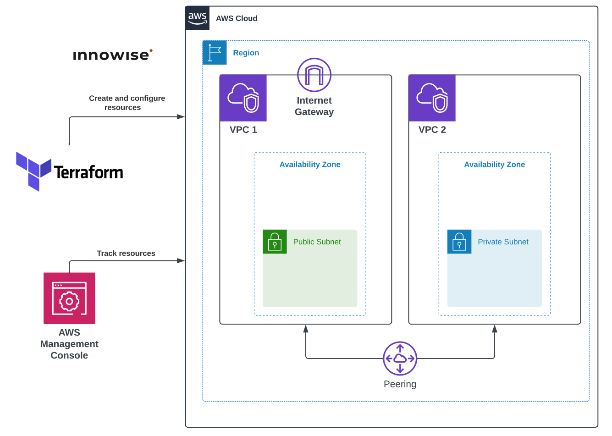

**1. Написать Terraform манифест для создания VPC Peering между двумя VPC согласно схеме.**

## Схема:

<div style="text-align:center;">
  
</div>

---

Реализованные модули:
- [x] 1. Module [instance](#module-instance)
- [x] 2. Module [private-subnets](#module-private-subnets)
- [x] 3. Module [public-subnets](#module-public-subnets)
- [x] 4. Module [security-group](#module-security-group)
- [x] 5. Module [vpc-peering](#module-vpc-peering)

Корневая директория (заголовочный файлы):
- [x] File [main.tf](#files-from-root-directory)
- [x] File [outputs.tf](#files-from-root-directory)
- [x] File [variables.tf](#files-from-root-directory)

## Modules folder [`(click)`](./files/Task6/modules/)

### Module [`instance`](./files/Task6/modules/instance/)

<details>
<summary>Просмотреть <b>main.tf</b> модуля <code>instance</code></summary>

```hcl
data "aws_ami" "latest_ubuntu" {
  most_recent = true

  filter {
    name   = "name"
    values = ["ubuntu/images/hvm-ssd/ubuntu-jammy-22.04-amd64-server-*"]
  }

  owners = ["099720109477"]
}

resource "aws_instance" "instance" {
  count = var.instance_count

  ami             = data.aws_ami.latest_ubuntu.id
  instance_type   = var.instance_type
  security_groups = [element(var.security_groups, count.index)]
  subnet_id       = element(var.subnet_id, count.index)
  key_name        = "khomenokkey"

  tags = merge(var.tags, lookup(var.tags_for_resource, "aws_instance", {}))
}
```

</details>
<br>

<details>
<summary>Просмотреть <b>outputs.tf</b> модуля <code>instance</code></summary>

```hcl
output "instance_ids" {
  value = aws_instance.instance.*.id
}
```

</details> 
<br>

<details>
<summary>Просмотреть <b>variables.tf</b> модуля <code>instance</code></summary>

```hcl
# Generic variables

variable "tags" {
  description = "A map of tags to assign to resources"
  type        = map(string)
  default     = {}
}

variable "tags_for_resource" {
  description = "A nested map of tags to assign to specific resource types"
  type        = map(map(string))
  default = {
    aws_web_instance = {
      "Name" = "Instance VPC Peering"
    }
  }
}

# Instance variables

variable "instance_count" {
  type    = string
  default = ""
}

variable "instance_type" {
  type    = string
  default = "t3.micro"
}

variable "subnet_id" {
  type    = list(string)
  default = []
}

variable "security_groups" {
  type = list(string)
}
```

</details>
<br>

### Module [`private-subnets`](./files/Task6/modules/private-subnets/)

<details>
<summary>Просмотреть <b>main.tf</b> модуля <code>private-subnets</code></summary>

```hcl
resource "aws_vpc" "private_vpc" {
  cidr_block = var.vpc_cidr_block
  tags = merge(var.tags, lookup(var.tags_for_resource, "aws_private_vpc",
    {
      "Name" = "Private VPC"
  }))
}

resource "aws_default_route_table" "vpc" {
  default_route_table_id = aws_vpc.private_vpc.default_route_table_id
  tags = merge(var.tags, lookup(var.tags_for_resource, "aws_default_route_table",
    {
      "Name" = "Default Route Table in Private VPC"
  }))
}

resource "aws_subnet" "private_subnet" {
  count = var.subnet_count

  vpc_id            = aws_vpc.private_vpc.id
  cidr_block        = element(var.subnet_cidr_block, count.index)
  availability_zone = var.availability_zone

  tags = merge(var.tags, lookup(var.tags_for_resource, "aws_private_subnet",
    {
      "Name" = "Private Subnet #${count.index + 1}"
  }))
}

resource "aws_route_table" "private_subnet_route_table" {
  vpc_id = aws_vpc.private_vpc.id

  tags = merge(var.tags, lookup(var.tags_for_resource,
    "aws_private_subnet_route_table",
    {
      "Name" = "Route table of Private Subnets"
  }))
}

resource "aws_route_table_association" "default" {
  count = var.subnet_count

  subnet_id      = element(aws_subnet.private_subnet.*.id, count.index)
  route_table_id = aws_route_table.private_subnet_route_table.id
}
```

</details>
<br>

<details>
<summary>Просмотреть <b>outputs.tf</b> модуля <code>private-subnets</code></summary>

```hcl
output "get_subnet_count" {
  description = "The number of subnets"
  value       = var.subnet_count
}

output "get_private_subnet_ids" {
  description = "List of subnet IDs"
  value       = aws_subnet.private_subnet.*.id
}

output "get_private_vpc_id" {
  value = aws_vpc.private_vpc.id
}

output "get_private_route_table_id" {
  description = "List of route table IDs"
  value       = aws_route_table.private_subnet_route_table.id
}
```

</details> 
<br>

<details>
<summary>Просмотреть <b>variables.tf</b> модуля <code>private-subnets</code></summary>

```hcl
# Private Subnet variables

variable "subnet_cidr_block" {
  description = "The CIDR blocks for private subnets"
  type        = list(string)
  default     = ["172.17.1.0/24"]
}

variable "subnet_count" {
  description = "The number of subnets to create"
  type        = string
}

variable "availability_zone" {
  description = "A list of availability zones to create the subnets in"
  type        = string
  default     = "eu-north-1a"
}

variable "tags" {
  description = "A map of tags to assign to resources"
  type        = map(string)
  default     = {}
}

variable "tags_for_resource" {
  description = "A nested map of tags to assign to specific resource types"
  type        = map(map(string))
  default     = {}
}

# VPC variables

variable "vpc_cidr_block" {
  type    = string
  default = "172.17.0.0/16"
}
```

</details>
<br>

### Module [`public-subnets`](./files/Task6/modules/public-subnets/)

<details>
<summary>Просмотреть <b>main.tf</b> модуля <code>public-subnets</code></summary>

```hcl
resource "aws_vpc" "public_vpc" {
  cidr_block = var.vpc_cidr_block
  tags = merge(var.tags, lookup(var.tags_for_resource, "aws_public_vpc",
    {
      "Name" = "Public VPC"
  }))
}

resource "aws_default_route_table" "vpc" {
  default_route_table_id = aws_vpc.public_vpc.default_route_table_id
  tags = merge(var.tags, lookup(var.tags_for_resource, "aws_default_route_table",
    {
      "Name" = "Default Route Table in Public VPC"
  }))
}

resource "aws_internet_gateway" "igw" {
  vpc_id = aws_vpc.public_vpc.id
  tags = merge(var.tags, lookup(var.tags_for_resource, "aws_internet_gateway",
    {
      "Name" = "Internet Gateway"
  }))
}

resource "aws_subnet" "public_subnet" {
  count = var.subnet_count

  vpc_id                  = aws_vpc.public_vpc.id
  cidr_block              = element(var.subnet_cidr_block, count.index)
  availability_zone       = var.availability_zone
  map_public_ip_on_launch = var.map_public_ip_on_launch

  tags = merge(var.tags, lookup(var.tags_for_resource, "aws_public_subnet",
    {
      "Name" = "Public Subnet #${count.index + 1}"
  }))
}

resource "aws_route_table" "public_subnet_route_table" {
  vpc_id = aws_vpc.public_vpc.id

  tags = merge(var.tags, lookup(var.tags_for_resource,
    "aws_public_subnet_route_table",
    {
      "Name" = "Route table of Public Subnets"
  }))
}

resource "aws_route" "internet_gateway" {
  count = var.subnet_count

  destination_cidr_block = "0.0.0.0/0"
  route_table_id         = element(aws_route_table.public_subnet_route_table.*.id, count.index)
  gateway_id             = aws_internet_gateway.igw.id
}

resource "aws_route_table_association" "default" {
  count = var.subnet_count

  subnet_id      = element(aws_subnet.public_subnet.*.id, count.index)
  route_table_id = aws_route_table.public_subnet_route_table.id
}
```

</details>
<br>

<details>
<summary>Просмотреть <b>outputs.tf</b> модуля <code>public-subnets</code></summary>

```hcl
output "get_subnet_count" {
  description = "The number of subnets"
  value       = var.subnet_count
}

output "get_public_subnet_ids" {
  description = "List of subnet IDs"
  value       = aws_subnet.public_subnet.*.id
}

output "get_public_vpc_id" {
  value = aws_vpc.public_vpc.id
}

output "get_public_route_table_id" {
  value = aws_route_table.public_subnet_route_table.id
}

```

</details>
<br>

<details>
<summary>Просмотреть <b>variables.tf</b> модуля <code>public-subnets</code></summary>

```hcl
# Public Subnet variables

variable "subnet_cidr_block" {
  description = "The CIDR blocks for public subnets"
  type        = list(string)
  default     = ["172.16.1.0/24"]
}

variable "subnet_count" {
  description = "The number of subnets to create"
  type        = string
}

variable "availability_zone" {
  description = "A name of availability zone"
  type        = string
  default     = "eu-north-1a"
}

variable "tags" {
  description = "A map of tags to assign to resources"
  type        = map(string)
  default     = {}
}

variable "tags_for_resource" {
  description = "A nested map of tags to assign to specific resource types"
  type        = map(map(string))
  default     = {}
}

variable "map_public_ip_on_launch" {
  description = "Assign a public IP address to instances launched into these subnets"
  type        = string
  default     = true
}

# VPC varibales

variable "vpc_cidr_block" {
  type    = string
  default = "172.16.0.0/16"
}
```

</details>
<br>

### Module [`security-group`](./files/Task6/modules/security-group/)

<details>
<summary>Просмотреть <b>main.tf</b> модуля <code>security-group</code></summary>

```hcl
resource "aws_security_group" "sg" {
  count = length(var.vpc_id)

  vpc_id = element(var.vpc_id, count.index)

  dynamic "ingress" {
    for_each = {
      ping_icmp = {
        from_port   = -1
        to_port     = -1
        protocol    = "icmp"
        cidr_blocks = ["172.16.0.0/16", "172.17.0.0/16"]
      },
      ssh_tcp = {
        from_port   = 22
        to_port     = 22
        protocol    = "tcp"
        cidr_blocks = ["0.0.0.0/0"]
      },
    }

    content {
      from_port   = ingress.value.from_port
      to_port     = ingress.value.to_port
      protocol    = ingress.value.protocol
      cidr_blocks = ingress.value.cidr_blocks
    }
  }

  egress {
    from_port   = 0
    to_port     = 0
    protocol    = "-1"
    cidr_blocks = ["0.0.0.0/0"]
  }

  tags = merge(var.tags, lookup(var.tags_for_resource, "aws_sg", {}))
}
```

</details>
<br>

<details>
<summary>Просмотреть <b>outputs.tf</b> модуля <code>security-group</code></summary>

```hcl
output "sg_id" {
  value = aws_security_group.sg.*.id
}
```

</details> 
<br>

<details>
<summary>Просмотреть <b>variables.tf</b> модуля <code>security-group</code></summary>

```hcl
# Generic variables

variable "tags" {
  description = "A map of tags to assign to resources"
  type        = map(string)
  default     = {}
}

variable "tags_for_resource" {
  description = "A nested map of tags to assign to specific resource types"
  type        = map(map(string))
  default = {
    aws_sg = {
      "Name" = "Security group for VPC Peering"
    }
  }
}

# SG variables

variable "vpc_id" {
  type    = list(string)
  default = []
}
```

</details>
<br>

### Module [`vpc-peering`](./files/Task6/modules/vpc-peering/)

<details>
<summary>Просмотреть <b>main.tf</b> модуля <code>vpc-peering</code></summary>

```hcl
resource "aws_vpc_peering_connection" "VPCPeeringConnection" {

  vpc_id      = var.vpc_id      // module.public_subnets.get_public_vpc_id
  peer_vpc_id = var.peer_vpc_id // module.private_subnets.get_private_vpc_id
  auto_accept = true

  tags = {
    Name = "PeeringConnectionBetweenVPCs"
  }
}

resource "aws_route" "add_routes" {
  count = (var.public_subnet_count + var.private_subnet_count)

  route_table_id            = element(var.route_table_id, count.index) // aws_route_table.private_subnet_route_table.id
  destination_cidr_block    = element(var.destination_cidr_block, count.index)
  vpc_peering_connection_id = aws_vpc_peering_connection.VPCPeeringConnection.id
}
```

</details>
<br>

<details>
<summary>Просмотреть <b>outputs.tf</b> модуля <code>vpc-peering</code></summary>

```hcl
output "nothing_to_output" {
    value = nothing.to.output
}
```

</details>
<br>

<details>
<summary>Просмотреть <b>variables.tf</b> модуля <code>vpc-peering</code></summary>

```hcl
variable "vpc_id" {
  type = string
}

variable "peer_vpc_id" {
  type = string
}

variable "destination_cidr_block" {
  type    = list(string)
  default = ["172.17.0.0/16", "172.16.0.0/16"]
}

variable "route_table_id" {
  type = list(string)
}

variable "public_subnet_count" {
  type    = string
  default = "1"
}

variable "private_subnet_count" {
  type    = string
  default = "1"
}
```

</details>
<br>

## Files from [`root directory`](./files/Task6/):

### File `main.tf`

<details>
<summary>Просмотреть <b>main.tf</b></summary>

```hcl
provider "aws" {
  region = "eu-north-1"
}

module "public_subnets" {
  source       = "./modules/public-subnets"
  subnet_count = var.public_subnet_count
}

module "private_subnets" {
  source       = "./modules/private-subnets"
  subnet_count = var.private_subnet_count
}

module "security_group" {
  source = "./modules/security-group"

  vpc_id = [module.public_subnets.get_public_vpc_id, module.private_subnets.get_private_vpc_id]
}

module "vpc_peering" {
  source = "./modules/vpc-peering"

  vpc_id         = module.public_subnets.get_public_vpc_id
  peer_vpc_id    = module.private_subnets.get_private_vpc_id
  route_table_id = [module.public_subnets.get_public_route_table_id, module.private_subnets.get_private_route_table_id]

  depends_on = [module.public_subnets, module.private_subnets]
}

module "instance" {
  source          = "./modules/instance"
  instance_count  = 2
  security_groups = module.security_group.sg_id
  subnet_id       = concat(module.public_subnets.get_public_subnet_ids, module.private_subnets.get_private_subnet_ids)
}
```

</details> 
<br>

<details>
<summary>Просмотреть <b>outputs.tf</b></summary>

```hcl
# Private & Public VPC IDs output

output "private_vpc_id" {
  description = "Private VPC ID"
  value       = module.private_subnets.get_private_vpc_id
}

output "public_vpc_id" {
  description = "Public VPC ID"
  value       = module.public_subnets.get_public_vpc_id
}

# Private & Public IDs output

output "private_subnet_ids" {
  description = "List of private subnet IDs"
  value       = module.private_subnets.get_private_subnet_ids
}

output "public_subnet_id" {
  description = "List of public subnet IDs"
  value       = module.public_subnets.get_public_subnet_ids
}
```

</details> 
<br>

<details>
<summary>Просмотреть <b>variables.tf</b></summary>

```hcl
# Generic variables

variable "tags" {
  description = "A map of tags to assign to resources"
  type        = map(string)
  default     = {}
}

variable "tags_for_resource" {
  description = "A nested map of tags to assign to specific resource types"
  type        = map(map(string))
  default     = {}
}

# Public subnet variables

variable "public_subnet_count" {
  description = "The number of public subnets to create"
  type        = string
  default     = "1"
}

# Private subnet variables

variable "private_subnet_count" {
  description = "The number of private subnets to create"
  type        = string
  default     = "1"
}
```

</details> 
<br>

## Checking VPC Peering Connection

**2. Проверить работоспособность пиринга. Можешь развернуть ec2 instance в каждом VPC и сделать ping.**

```bash
Welcome to Ubuntu 22.04.3 LTS (GNU/Linux 6.2.0-1014-aws x86_64)

 * Documentation:  https://help.ubuntu.com
 * Management:     https://landscape.canonical.com
 * Support:        https://ubuntu.com/advantage

  System information as of Thu Oct 26 09:42:39 UTC 2023

  System load:  0.4482421875      Processes:             112
  Usage of /:   20.6% of 7.57GB   Users logged in:       0
  Memory usage: 24%               IPv4 address for ens5: 172.16.1.126
  Swap usage:   0%

hostname -I
172.16.1.126 
ubuntu@ip-172-16-1-126:~$ ping 172.17.1.16
PING 172.17.1.16 (172.17.1.16) 56(84) bytes of data.
64 bytes from 172.17.1.16: icmp_seq=1 ttl=64 time=0.140 ms
64 bytes from 172.17.1.16: icmp_seq=2 ttl=64 time=0.149 ms
64 bytes from 172.17.1.16: icmp_seq=3 ttl=64 time=0.167 ms
64 bytes from 172.17.1.16: icmp_seq=4 ttl=64 time=0.220 ms
64 bytes from 172.17.1.16: icmp_seq=5 ttl=64 time=0.178 ms
^C
--- 172.17.1.16 ping statistics ---
5 packets transmitted, 5 received, 0% packet loss, time 4088ms
rtt min/avg/max/mdev = 0.140/0.170/0.220/0.027 ms
```