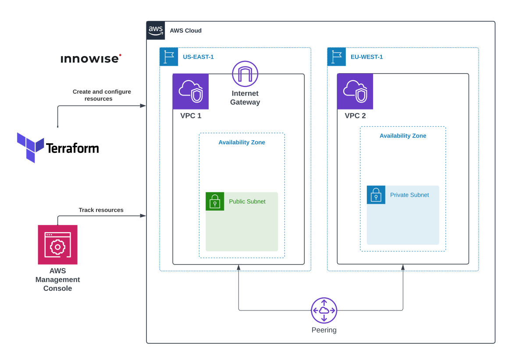

**1. Написать Terraform манифест для создания VPC Peering между двумя VPC в разных регионах согласно схеме.**

## Схема:

<div style="text-align:center;">
  
</div>

---

Реализованные модули:
- [x] 1. Module [instance](#instance-module)
- [x] 2. Module [private-subnets](#private-subnets-module)
- [x] 3. Module [public-subnets](#public-subnets-module)
- [x] 4. Module [security-group](#security-group-module)
- [x] 5. Module [vpc-peering](#vpc-peering-module)

Корневая директория (заголовочный файлы):
- [x] File [main.tf](#files-from-the-root-directory-header-files)
- [x] File [outputs.tf](#files-from-the-root-directory-header-files)
- [x] File [variables.tf](#files-from-the-root-directory-header-files)

## Modules directory [`(click to go to the root directory of modules)`](./files/Task7/modules/)

### [`Instance`](./files/Task7/modules/instance/) module

<details>
<summary>View the <b>main.tf</b> file of the <code>instance</code> module</summary>

```hcl
terraform {
  required_providers {
    aws = {
      source  = "hashicorp/aws"
      version = "~> 5.23"
    }
  }
}

data "aws_ami" "latest_ubuntu" {
  most_recent = true

  filter {
    name   = "name"
    values = ["ubuntu/images/hvm-ssd/ubuntu-jammy-22.04-amd64-server-*"]
  }

  owners = ["099720109477"]
}

resource "aws_instance" "instance" {
  ami             = data.aws_ami.latest_ubuntu.id
  instance_type   = var.instance_type
  security_groups = [var.security_groups]
  subnet_id       = var.subnet_id
  key_name        = var.key_name

  tags = merge(var.tags, lookup(var.tags_for_resource, "aws_instance", {}))
}
```

</details>
<br>

<details>
<summary>View the <b>outputs.tf</b> file of the <code>instance</code> module</summary>

```hcl
output "instance_ids" {
  value = aws_instance.instance.*.id
}
```

</details> 
<br>

<details>
<summary>View the <b>variables.tf</b> file of the <code>instance</code> module</summary>

```hcl
# Generic variables

variable "tags" {
  description = "A map of tags to assign to resources"
  type        = map(string)
  default     = {}
}

variable "tags_for_resource" {
  description = "A nested map of tags to assign to specific resource types"
  type        = map(map(string))
  default = {
    aws_web_instance = {
      "Name" = "Instance VPC Peering"
    }
  }
}

# Instance variables

variable "instance_count" {
  type    = string
  default = ""
}

variable "instance_type" {
  type    = string
  default = "t3.micro"
}

variable "subnet_id" {
  type    = string
  default = ""
}

variable "security_groups" {
  type = string
}

variable "key_name" {
  type    = string
  default = ""
}
```

</details>
<br>

### [`Private-subnets`](./files/Task7/modules/private-subnets/) module

<details>
<summary>View the <b>main.tf</b> file of the <code>private-subnets</code> module</summary>

```hcl
terraform {
  required_providers {
    aws = {
      source  = "hashicorp/aws"
      version = "~> 5.23"
    }
  }
}

resource "aws_vpc" "private_vpc" {
  cidr_block = var.vpc_cidr_block
  tags = merge(var.tags, lookup(var.tags_for_resource, "aws_private_vpc",
    {
      "Name" = "Private VPC"
  }))
}

resource "aws_default_route_table" "vpc" {
  default_route_table_id = aws_vpc.private_vpc.default_route_table_id
  tags = merge(var.tags, lookup(var.tags_for_resource, "aws_default_route_table",
    {
      "Name" = "Default Route Table in Private VPC"
  }))
}

resource "aws_subnet" "private_subnet" {
  count = var.subnet_count

  vpc_id            = aws_vpc.private_vpc.id
  cidr_block        = element(var.subnet_cidr_block, count.index)
  availability_zone = var.availability_zone

  tags = merge(var.tags, lookup(var.tags_for_resource, "aws_private_subnet",
    {
      "Name" = "Private Subnet #${count.index + 1}"
  }))
}

resource "aws_route_table" "private_subnet_route_table" {
  vpc_id = aws_vpc.private_vpc.id

  tags = merge(var.tags, lookup(var.tags_for_resource,
    "aws_private_subnet_route_table",
    {
      "Name" = "Route table of Private Subnets"
  }))
}

resource "aws_route_table_association" "default" {
  count = var.subnet_count

  subnet_id      = element(aws_subnet.private_subnet.*.id, count.index)
  route_table_id = aws_route_table.private_subnet_route_table.id
}
```

</details>
<br>

<details>
<summary>View the <b>outputs.tf</b> file of the <code>private-subnets</code> module</summary>

```hcl
output "get_subnet_count" {
  description = "The number of subnets"
  value       = var.subnet_count
}

output "get_private_subnet_ids" {
  description = "List of subnet IDs"
  value       = aws_subnet.private_subnet.*.id
}

output "get_private_vpc_id" {
  value = aws_vpc.private_vpc.id
}

output "get_private_route_table_id" {
  description = "List of route table IDs"
  value       = aws_route_table.private_subnet_route_table.id
}
```

</details> 
<br>

<details>
<summary>View the <b>variables.tf</b> file of the <code>private-subnets</code> module</summary>

```hcl
# Private Subnet variables

variable "subnet_cidr_block" {
  description = "The CIDR blocks for private subnets"
  type        = list(string)
  default     = ["172.17.1.0/24"]
}

variable "subnet_count" {
  description = "The number of subnets to create"
  type        = string
}

variable "availability_zone" {
  description = "A list of availability zones to create the subnets in"
  type        = string
  default     = "eu-west-1a"
}

variable "tags" {
  description = "A map of tags to assign to resources"
  type        = map(string)
  default     = {}
}

variable "tags_for_resource" {
  description = "A nested map of tags to assign to specific resource types"
  type        = map(map(string))
  default     = {}
}

# VPC variables

variable "vpc_cidr_block" {
  type    = string
  default = "172.17.0.0/16"
}
```

</details>
<br>

### [`Public-subnets`](./files/Task7/modules/public-subnets/) module

<details>
<summary>View the <b>main.tf</b> file of the <code>public-subnets</code> module</summary>

```hcl
terraform {
  required_providers {
    aws = {
      source  = "hashicorp/aws"
      version = "~> 5.23"
    }
  }
}

resource "aws_vpc" "public_vpc" {
  cidr_block = var.vpc_cidr_block
  tags = merge(var.tags, lookup(var.tags_for_resource, "aws_public_vpc",
    {
      "Name" = "Public VPC"
  }))
}

resource "aws_default_route_table" "vpc" {
  default_route_table_id = aws_vpc.public_vpc.default_route_table_id
  tags = merge(var.tags, lookup(var.tags_for_resource, "aws_default_route_table",
    {
      "Name" = "Default Route Table in Public VPC"
  }))
}

resource "aws_internet_gateway" "igw" {
  vpc_id = aws_vpc.public_vpc.id
  tags = merge(var.tags, lookup(var.tags_for_resource, "aws_internet_gateway",
    {
      "Name" = "Internet Gateway"
  }))
}

resource "aws_subnet" "public_subnet" {
  count = var.subnet_count

  vpc_id                  = aws_vpc.public_vpc.id
  cidr_block              = element(var.subnet_cidr_block, count.index)
  availability_zone       = var.availability_zone
  map_public_ip_on_launch = var.map_public_ip_on_launch

  tags = merge(var.tags, lookup(var.tags_for_resource, "aws_public_subnet",
    {
      "Name" = "Public Subnet #${count.index + 1}"
  }))
}

resource "aws_route_table" "public_subnet_route_table" {
  vpc_id = aws_vpc.public_vpc.id

  tags = merge(var.tags, lookup(var.tags_for_resource,
    "aws_public_subnet_route_table",
    {
      "Name" = "Route table of Public Subnets"
  }))
}

resource "aws_route" "internet_gateway" {
  count = var.subnet_count

  destination_cidr_block = "0.0.0.0/0"
  route_table_id         = element(aws_route_table.public_subnet_route_table.*.id, count.index)
  gateway_id             = aws_internet_gateway.igw.id
}

resource "aws_route_table_association" "default" {
  count = var.subnet_count

  subnet_id      = element(aws_subnet.public_subnet.*.id, count.index)
  route_table_id = aws_route_table.public_subnet_route_table.id
}
```

</details>
<br>

<details>
<summary>View the <b>outputs.tf</b> file of the <code>public-subnets</code> module</summary>

```hcl
output "get_subnet_count" {
  description = "The number of subnets"
  value       = var.subnet_count
}

output "get_public_subnet_ids" {
  description = "List of subnet IDs"
  value       = aws_subnet.public_subnet.*.id
}

output "get_public_vpc_id" {
  value = aws_vpc.public_vpc.id
}

output "get_public_route_table_id" {
  value = aws_route_table.public_subnet_route_table.id
}
```

</details>
<br>

<details>
<summary>View the <b>variables.tf</b> file of the <code>public-subnets</code> module</summary>

```hcl
# Public Subnet variables

variable "subnet_cidr_block" {
  description = "The CIDR blocks for public subnets"
  type        = list(string)
  default     = ["172.16.1.0/24"]
}

variable "subnet_count" {
  description = "The number of subnets to create"
  type        = string
}

variable "availability_zone" {
  description = "A name of availability zone"
  type        = string
  default     = "us-east-1a"
}

variable "tags" {
  description = "A map of tags to assign to resources"
  type        = map(string)
  default     = {}
}

variable "tags_for_resource" {
  description = "A nested map of tags to assign to specific resource types"
  type        = map(map(string))
  default     = {}
}

variable "map_public_ip_on_launch" {
  description = "Assign a public IP address to instances launched into these subnets"
  type        = string
  default     = true
}

# VPC varibales

variable "vpc_cidr_block" {
  type    = string
  default = "172.16.0.0/16"
}
```

</details>
<br>

### [`Security-group`](./files/Task7/modules/security-group/) module

<details>
<summary>View the <b>main.tf</b> file of the <code>security-group</code> module</summary>

```hcl
terraform {
  required_providers {
    aws = {
      source  = "hashicorp/aws"
      version = "~> 5.23"
    }
  }
}

resource "aws_security_group" "sg" {
  vpc_id = var.vpc_id

  dynamic "ingress" {
    for_each = {
      ping_icmp = {
        from_port   = -1
        to_port     = -1
        protocol    = "icmp"
        cidr_blocks = ["172.16.0.0/16", "172.17.0.0/16"]
      },
      ssh_tcp = {
        from_port   = 22
        to_port     = 22
        protocol    = "tcp"
        cidr_blocks = ["0.0.0.0/0"]
      },
    }

    content {
      from_port   = ingress.value.from_port
      to_port     = ingress.value.to_port
      protocol    = ingress.value.protocol
      cidr_blocks = ingress.value.cidr_blocks
    }
  }

  egress {
    from_port   = 0
    to_port     = 0
    protocol    = "-1"
    cidr_blocks = ["0.0.0.0/0"]
  }

  tags = merge(var.tags, lookup(var.tags_for_resource, "aws_sg", {}))
}
```

</details>
<br>

<details>
<summary>View the <b>outputs.tf</b> file of the <code>security-group</code> module</summary>

```hcl
output "sg_id" {
  value = aws_security_group.sg.id
}
```

</details> 
<br>

<details>
<summary>View the <b>variables.tf</b> file of the <code>security-group</code> module</summary>

```hcl
# Generic variables

variable "tags" {
  description = "A map of tags to assign to resources"
  type        = map(string)
  default     = {}
}

variable "tags_for_resource" {
  description = "A nested map of tags to assign to specific resource types"
  type        = map(map(string))
  default = {
    aws_sg = {
      "Name" = "Security group for VPC Peering"
    }
  }
}

# SG variables

variable "vpc_id" {
  type    = string
  default = ""
}
```

</details>
<br>

### [`Vpc-peering`](./files/Task7/modules/vpc-peering/) module

<details>
<summary>View the <b>main.tf</b> file of the <code>vpc-peering</code> module</summary>

```hcl
terraform {
  required_providers {
    aws = {
      source  = "hashicorp/aws"
      version = "~> 5.23"
    }
  }
}

resource "aws_vpc_peering_connection" "VPCPeeringConnection" {
  count = var.count_vpc_peering

  vpc_id      = var.vpc_id
  peer_vpc_id = var.peer_vpc_id
  peer_region = var.peer_region

  tags = {
    Name = "PeeringConnectionBetweenVPCs"
  }
}

resource "aws_route" "add_routes" {
  route_table_id            = var.route_table_id
  destination_cidr_block    = var.destination_cidr_block
  vpc_peering_connection_id = var.vpc_peering_connection_id
}
```

</details>
<br>

<details>
<summary>View the <b>outputs.tf</b> file of the <code>vpc-peering</code> module</summary>

```hcl
output "get_vpc_peering_id" {
  value = aws_vpc_peering_connection.VPCPeeringConnection.*.id
}
```

</details>
<br>

<details>
<summary>View the <b>variables.tf</b> file of the <code>vpc-peering</code> module</summary>

```hcl
variable "vpc_id" {
  type    = string
  default = ""
}

variable "peer_vpc_id" {
  type    = string
  default = ""
}

# variable "destination_cidr_block" {
#   type    = list(string)
#   default = ["172.17.0.0/16", "172.16.0.0/16"]
# }

# variable "route_table_id" {
#   type = list(string)
# }

variable "destination_cidr_block" {
  type    = string
  default = ""
}

variable "route_table_id" {
  type    = string
  default = ""
}

variable "vpc_peering_connection_id" {
  type    = string
  default = ""
}

variable "public_subnet_count" {
  type    = string
  default = "1"
}

variable "private_subnet_count" {
  type    = string
  default = "1"
}

variable "peer_region" {
  type    = string
  default = ""
}

variable "count_vpc_peering" {
  type    = string
  default = "1"
}
```

</details>
<br>

## Files from the [`root directory`](./files/Task7/) (header files)

### File `main.tf`

<details>
<summary>View the <b>main.tf</b> file</summary>

```hcl
provider "aws" {
  region = "us-east-1"
}

provider "aws" {
  region = "eu-west-1"
  alias  = "private_subnet"
}

module "public_subnets" {
  source       = "./modules/public-subnets"
  subnet_count = var.public_subnet_count
}

module "private_subnets" {
  source       = "./modules/private-subnets"
  subnet_count = var.private_subnet_count
  providers    = { aws = aws.private_subnet }
}

module "public_subnet_security_group" {
  source = "./modules/security-group"

  vpc_id     = module.public_subnets.get_public_vpc_id
  depends_on = [module.public_subnets]
}

module "private_subnet_security_group" {
  source = "./modules/security-group"

  vpc_id     = module.private_subnets.get_private_vpc_id
  depends_on = [module.private_subnets]
  providers = {
    aws = aws.private_subnet
  }
}

module "vpc_peering" {
  source = "./modules/vpc-peering"

  vpc_id      = module.public_subnets.get_public_vpc_id
  peer_vpc_id = module.private_subnets.get_private_vpc_id
  peer_region = "eu-west-1"

  route_table_id            = module.public_subnets.get_public_route_table_id
  vpc_peering_connection_id = module.vpc_peering.get_vpc_peering_id[0]
  destination_cidr_block    = "172.17.0.0/16"

  depends_on = [module.public_subnet_security_group]
}

module "vpc_peering_route" {
  source            = "./modules/vpc-peering"
  count_vpc_peering = 0

  route_table_id            = module.private_subnets.get_private_route_table_id
  destination_cidr_block    = "172.16.0.0/16"
  vpc_peering_connection_id = module.vpc_peering.get_vpc_peering_id[0]

  providers = {
    aws = aws.private_subnet
  }

  depends_on = [module.private_subnet_security_group]
}

resource "aws_vpc_peering_connection_accepter" "peer_private" {
  provider                  = aws.private_subnet
  vpc_peering_connection_id = module.vpc_peering.get_vpc_peering_id[0]
  auto_accept               = true
}

module "public_instance" {
  source          = "./modules/instance"
  security_groups = module.public_subnet_security_group.sg_id
  subnet_id       = module.public_subnets.get_public_subnet_ids[0]
  key_name        = "khomenokkey"
  depends_on      = [module.vpc_peering]
}

module "private_instance" {
  source          = "./modules/instance"
  security_groups = module.private_subnet_security_group.sg_id
  subnet_id       = module.private_subnets.get_private_subnet_ids[0]
  providers = {
    aws = aws.private_subnet
  }
  depends_on = [module.vpc_peering]
}
```

</details> 
<br>

<details>
<summary>View the <b>outputs.tf</b> file</summary>

```hcl
# Private & Public VPC IDs output

output "private_vpc_id" {
  description = "Private VPC ID"
  value       = module.private_subnets.get_private_vpc_id
}

output "public_vpc_id" {
  description = "Public VPC ID"
  value       = module.public_subnets.get_public_vpc_id
}

# Private & Public IDs output

output "private_subnet_ids" {
  description = "List of private subnet IDs"
  value       = module.private_subnets.get_private_subnet_ids
}

output "public_subnet_id" {
  description = "List of public subnet IDs"
  value       = module.public_subnets.get_public_subnet_ids
}
```

</details> 
<br>

<details>
<summary>View the <b>variables.tf</b> file</summary>

```hcl
# Generic variables

variable "tags" {
  description = "A map of tags to assign to resources"
  type        = map(string)
  default     = {}
}

variable "tags_for_resource" {
  description = "A nested map of tags to assign to specific resource types"
  type        = map(map(string))
  default     = {}
}

# Public subnet variables

variable "public_subnet_count" {
  description = "The number of public subnets to create"
  type        = string
  default     = "1"
}

# Private subnet variables

variable "private_subnet_count" {
  description = "The number of private subnets to create"
  type        = string
  default     = "1"
}
```

</details> 
<br>

## Checking VPC Peering Connection

**2. Проверяем работоспособность пиринга.**

<div style="text-align:center;">
  
</div>