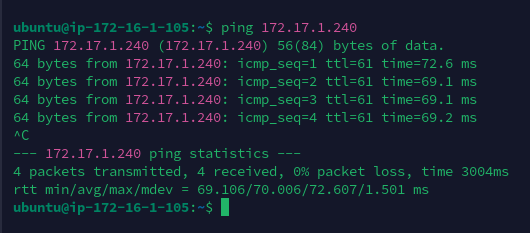

**1. Написать Terraform манифест для Transit Gateway между двумя VPC в разных регионах согласно схеме (схемы нет, там схема с прошлого задания).**

### Схема c прошлого задания:

<div style="text-align:center;">
  
</div>

---

Реализованные модули:
- [x] 1. Module [instance](#instance-module)
- [x] 2. Module [private_subnets](#private_subnets-module)
- [x] 3. Module [public_subnets](#public_subnets-module)
- [x] 4. Module [security_group](#security_group-module)
- [x] 5. Module [transit_gateway](#transit_gateway-module)

Корневая директория (заголовочный файлы):
- [x] File [main.tf](#files-from-the-root-directory-header-files)
- [x] File [outputs.tf](#files-from-the-root-directory-header-files)
- [x] File [variables.tf](#files-from-the-root-directory-header-files)

## Modules directory [`(click to go to the root directory of modules)`](./files/Task8/modules/)

### [`Instance`](./files/Task8/modules/instance/) module

<details>
<summary>View the <b>main.tf</b> file of the <code>instance</code> module</summary>

```hcl
terraform {
  required_providers {
    aws = {
      source = "hashicorp/aws"
      configuration_aliases = [
        aws.public_subnet,
        aws.private_subnet
      ]
    }
  }
}

data "aws_ami" "latestUbuntu_public" {
  most_recent = true
  provider    = aws.public_subnet

  filter {
    name   = "name"
    values = ["ubuntu/images/hvm-ssd/ubuntu-jammy-22.04-amd64-server-*"]
  }

  owners = ["099720109477"]
}

data "aws_ami" "latestUbuntu_private" {
  most_recent = true
  provider    = aws.private_subnet

  filter {
    name   = "name"
    values = ["ubuntu/images/hvm-ssd/ubuntu-jammy-22.04-amd64-server-*"]
  }

  owners = ["099720109477"]
}

resource "aws_instance" "public_instance" {
  provider = aws.public_subnet

  ami           = data.aws_ami.latestUbuntu_public.id
  instance_type = var.instance_type

  security_groups = [var.public_instance_security_groups]
  subnet_id       = var.public_instance_subnet_id
  key_name        = var.public_instance_key_name

  tags = merge(var.tags, lookup(var.tags_for_resource, "aws_public_instance", {}))
}

resource "aws_instance" "private_instance" {
  provider = aws.private_subnet

  ami           = data.aws_ami.latestUbuntu_private.id
  instance_type = var.instance_type

  security_groups = [var.private_instance_security_groups]
  subnet_id       = var.private_instance_subnet_id

  tags = merge(var.tags, lookup(var.tags_for_resource, "aws_private_instance", {}))
}
```

</details>
<br>

<details>
<summary>View the <b>outputs.tf</b> file of the <code>instance</code> module</summary>

```hcl
output "get_public_instance_ids" {
  value = aws_instance.public_instance.*.id
}

output "get_private_instance_ids" {
  value = aws_instance.private_instance.*.id
}
```

</details> 
<br>

<details>
<summary>View the <b>variables.tf</b> file of the <code>instance</code> module</summary>

```hcl
# Generic variables

variable "tags" {
  description = "A map of tags to assign to resources"
  type        = map(string)
  default     = {}
}

variable "tags_for_resource" {
  description = "A nested map of tags to assign to specific resource types"
  type        = map(map(string))
  default = {
    aws_public_instance  = { "Name" = "Public Instance of TGW Peering" }
    aws_private_instance = { "Name" = "Private Instance of TGW Peering" }
  }
}

# Instance variables

variable "instance_count" {
  type    = string
  default = ""
}

variable "instance_type" {
  type    = string
  default = "t3.micro"
}

variable "public_instance_security_groups" {
  type    = string
  default = ""
}

variable "public_instance_subnet_id" {
  type    = string
  default = ""
}

variable "public_instance_key_name" {
  type    = string
  default = ""
}

variable "private_instance_security_groups" {
  type    = string
  default = ""
}

variable "private_instance_subnet_id" {
  type    = string
  default = ""
}
```

</details>
<br>

### [`Private_subnets`](./files/Task8/modules/private_subnets/) module

<details>
<summary>View the <b>main.tf</b> file of the <code>private_subnets</code> module</summary>

```hcl
terraform {
  required_providers {
    aws = {
      source  = "hashicorp/aws"
      version = "~> 5.23"
    }
  }
}

resource "aws_vpc" "private_vpc" {
  cidr_block = var.vpc_cidr_block
  tags = merge(var.tags, lookup(var.tags_for_resource, "aws_private_vpc",
    {
      "Name" = "Private VPC"
  }))
}

resource "aws_default_route_table" "vpc" {
  default_route_table_id = aws_vpc.private_vpc.default_route_table_id
  tags = merge(var.tags, lookup(var.tags_for_resource, "aws_default_route_table",
    {
      "Name" = "Default Route Table in Private VPC"
  }))
}

resource "aws_subnet" "private_subnet" {
  count = var.subnet_count

  vpc_id            = aws_vpc.private_vpc.id
  cidr_block        = element(var.subnet_cidr_block, count.index)
  availability_zone = var.availability_zone

  tags = merge(var.tags, lookup(var.tags_for_resource, "aws_private_subnet",
    {
      "Name" = "Private Subnet #${count.index + 1}"
  }))
}

resource "aws_route_table" "private_subnet_route_table" {
  vpc_id = aws_vpc.private_vpc.id

  tags = merge(var.tags, lookup(var.tags_for_resource,
    "aws_private_subnet_route_table",
    {
      "Name" = "Route table of Private Subnets"
  }))
}

resource "aws_route_table_association" "default" {
  count = var.subnet_count

  subnet_id      = element(aws_subnet.private_subnet.*.id, count.index)
  route_table_id = aws_route_table.private_subnet_route_table.id
}
```

</details>
<br>

<details>
<summary>View the <b>outputs.tf</b> file of the <code>private_subnets</code> module</summary>

```hcl
output "get_subnet_count" {
  description = "The number of subnets"
  value       = var.subnet_count
}

output "get_private_subnet_ids" {
  description = "List of subnet IDs"
  value       = aws_subnet.private_subnet.*.id
}

output "get_private_vpc_id" {
  value = aws_vpc.private_vpc.id
}

output "get_private_route_table_id" {
  description = "List of route table IDs"
  value       = aws_route_table.private_subnet_route_table.id
}
```

</details> 
<br>

<details>
<summary>View the <b>variables.tf</b> file of the <code>private_subnets</code> module</summary>

```hcl
# Private Subnet variables

variable "subnet_cidr_block" {
  description = "The CIDR blocks for private subnets"
  type        = list(string)
  default     = ["172.17.1.0/24"]
}

variable "subnet_count" {
  description = "The number of subnets to create"
  type        = string
}

variable "availability_zone" {
  description = "A list of availability zones to create the subnets in"
  type        = string
  default     = "eu-west-1a"
}

variable "tags" {
  description = "A map of tags to assign to resources"
  type        = map(string)
  default     = {}
}

variable "tags_for_resource" {
  description = "A nested map of tags to assign to specific resource types"
  type        = map(map(string))
  default     = {}
}

# VPC variables

variable "vpc_cidr_block" {
  type    = string
  default = "172.17.0.0/16"
}
```

</details>
<br>

### [`Public_subnets`](./files/Task8/modules/public_subnets/) module

<details>
<summary>View the <b>main.tf</b> file of the <code>public_subnets</code> module</summary>

```hcl
terraform {
  required_providers {
    aws = {
      source  = "hashicorp/aws"
      version = "~> 5.23"
    }
  }
}

resource "aws_vpc" "public_vpc" {
  cidr_block = var.vpc_cidr_block
  tags = merge(var.tags, lookup(var.tags_for_resource, "aws_public_vpc",
    {
      "Name" = "Public VPC"
  }))
}

resource "aws_default_route_table" "vpc" {
  default_route_table_id = aws_vpc.public_vpc.default_route_table_id
  tags = merge(var.tags, lookup(var.tags_for_resource, "aws_default_route_table",
    {
      "Name" = "Default Route Table in Public VPC"
  }))
}

resource "aws_internet_gateway" "igw" {
  vpc_id = aws_vpc.public_vpc.id
  tags = merge(var.tags, lookup(var.tags_for_resource, "aws_internet_gateway",
    {
      "Name" = "Internet Gateway"
  }))
}

resource "aws_subnet" "public_subnet" {
  count = var.subnet_count

  vpc_id                  = aws_vpc.public_vpc.id
  cidr_block              = element(var.subnet_cidr_block, count.index)
  availability_zone       = var.availability_zone
  map_public_ip_on_launch = var.map_public_ip_on_launch

  tags = merge(var.tags, lookup(var.tags_for_resource, "aws_public_subnet",
    {
      "Name" = "Public Subnet #${count.index + 1}"
  }))
}

resource "aws_route_table" "public_subnet_route_table" {
  vpc_id = aws_vpc.public_vpc.id

  tags = merge(var.tags, lookup(var.tags_for_resource,
    "aws_public_subnet_route_table",
    {
      "Name" = "Route table of Public Subnets"
  }))
}

resource "aws_route" "internet_gateway" {
  count = var.subnet_count

  destination_cidr_block = "0.0.0.0/0"
  route_table_id         = element(aws_route_table.public_subnet_route_table.*.id, count.index)
  gateway_id             = aws_internet_gateway.igw.id
}

resource "aws_route_table_association" "default" {
  count = var.subnet_count

  subnet_id      = element(aws_subnet.public_subnet.*.id, count.index)
  route_table_id = aws_route_table.public_subnet_route_table.id
}
```

</details>
<br>

<details>
<summary>View the <b>outputs.tf</b> file of the <code>public_subnets</code> module</summary>

```hcl
output "get_subnet_count" {
  description = "The number of subnets"
  value       = var.subnet_count
}

output "get_public_subnet_ids" {
  description = "List of subnet IDs"
  value       = aws_subnet.public_subnet.*.id
}

output "get_public_vpc_id" {
  value = aws_vpc.public_vpc.id
}

output "get_public_route_table_id" {
  value = aws_route_table.public_subnet_route_table.id
}
```

</details>
<br>

<details>
<summary>View the <b>variables.tf</b> file of the <code>public_subnets</code> module</summary>

```hcl
# Public Subnet variables

variable "subnet_cidr_block" {
  description = "The CIDR blocks for public subnets"
  type        = list(string)
  default     = ["172.16.1.0/24"]
}

variable "subnet_count" {
  description = "The number of subnets to create"
  type        = string
}

variable "availability_zone" {
  description = "A name of availability zone"
  type        = string
  default     = "us-east-1a"
}

variable "tags" {
  description = "A map of tags to assign to resources"
  type        = map(string)
  default     = {}
}

variable "tags_for_resource" {
  description = "A nested map of tags to assign to specific resource types"
  type        = map(map(string))
  default     = {}
}

variable "map_public_ip_on_launch" {
  description = "Assign a public IP address to instances launched into these subnets"
  type        = string
  default     = true
}

# VPC varibales

variable "vpc_cidr_block" {
  type    = string
  default = "172.16.0.0/16"
}
```

</details>
<br>

### [`Security_group`](./files/Task8/modules/security_group/) module

<details>
<summary>View the <b>main.tf</b> file of the <code>security_group</code> module</summary>

```hcl
terraform {
  required_providers {
    aws = {
      source  = "hashicorp/aws"
      version = "~> 5.23"
    }
  }
}

resource "aws_security_group" "sg" {
  vpc_id = var.vpc_id

  dynamic "ingress" {
    for_each = {
      ping_icmp = {
        from_port   = -1
        to_port     = -1
        protocol    = "icmp"
        cidr_blocks = ["172.16.0.0/16", "172.17.0.0/16"]
      },
      ssh_tcp = {
        from_port   = 22
        to_port     = 22
        protocol    = "tcp"
        cidr_blocks = ["0.0.0.0/0"]
      },
    }

    content {
      from_port   = ingress.value.from_port
      to_port     = ingress.value.to_port
      protocol    = ingress.value.protocol
      cidr_blocks = ingress.value.cidr_blocks
    }
  }

  egress {
    from_port   = 0
    to_port     = 0
    protocol    = "-1"
    cidr_blocks = ["0.0.0.0/0"]
  }

  tags = merge(var.tags, lookup(var.tags_for_resource, "aws_sg", {}))
}
```

</details>
<br>

<details>
<summary>View the <b>outputs.tf</b> file of the <code>security_group</code> module</summary>

```hcl
output "sg_id" {
  value = aws_security_group.sg.id
}
```

</details> 
<br>

<details>
<summary>View the <b>variables.tf</b> file of the <code>security_group</code> module</summary>

```hcl
# Generic variables

variable "tags" {
  description = "A map of tags to assign to resources"
  type        = map(string)
  default     = {}
}

variable "tags_for_resource" {
  description = "A nested map of tags to assign to specific resource types"
  type        = map(map(string))
  default = {
    aws_sg = {
      "Name" = "Security group for TGW Peering"
    }
  }
}

# SG variables

variable "vpc_id" {
  type    = string
  default = ""
}
```

</details>
<br>

### [`Transit_gateway`](./files/Task8/modules/transit_gateway/) module

<details>
<summary>View the <b>main.tf</b> file of the <code>transit_gateway</code> module</summary>

```hcl
terraform {
  required_providers {
    aws = {
      source = "hashicorp/aws"
      configuration_aliases = [
        aws.public_subnet,
        aws.private_subnet
      ]
    }
  }
}

data "aws_region" "peering" {
  provider = aws.private_subnet
}

# Get default route table ID of TGW (Public Subnet & Private Subnet)

data "aws_ec2_transit_gateway_route_table" "get_public" {
  provider = aws.public_subnet

  filter {
    name   = "default-association-route-table"
    values = ["true"]
  }

  filter {
    name   = "transit-gateway-id"
    values = ["${aws_ec2_transit_gateway.public_tgw.id}"]
  }
}

data "aws_ec2_transit_gateway_route_table" "get_private" {
  provider = aws.private_subnet

  filter {
    name   = "default-association-route-table"
    values = ["true"]
  }

  filter {
    name   = "transit-gateway-id"
    values = ["${aws_ec2_transit_gateway.private_tgw.id}"]
  }
}

##################################################################

# Create TGW for public subnet (us-east-1) & private private subnet (eu-west-1)

resource "aws_ec2_transit_gateway" "public_tgw" {
  provider                       = aws.public_subnet
  description                    = "Public Transit Gateway"
  auto_accept_shared_attachments = "enable"
}

resource "aws_ec2_transit_gateway" "private_tgw" {
  provider                       = aws.private_subnet
  description                    = "Private Transit Gateway"
  auto_accept_shared_attachments = "enable"
}

##################################################################

# Create VPC attachment (Public & Private subnets)

resource "aws_ec2_transit_gateway_vpc_attachment" "public" {
  provider   = aws.public_subnet
  vpc_id     = var.public_vpc_id
  subnet_ids = [var.public_subnet_ids]

  transit_gateway_id = aws_ec2_transit_gateway.public_tgw.id

  tags = merge(var.tags, lookup(var.tags_for_resource, "tgw_vpc_attachment_public", {}))
}

resource "aws_ec2_transit_gateway_vpc_attachment" "private" {
  provider   = aws.private_subnet
  vpc_id     = var.private_vpc_id
  subnet_ids = [var.private_subnet_ids]

  transit_gateway_id = aws_ec2_transit_gateway.private_tgw.id

  tags = merge(var.tags, lookup(var.tags_for_resource, "tgw_vpc_attachment_private", {}))
}

# Create peering attachment between Public --> Private Subnets

resource "aws_ec2_transit_gateway_peering_attachment" "peering_private" {
  provider = aws.public_subnet

  peer_region             = data.aws_region.peering.name
  peer_transit_gateway_id = aws_ec2_transit_gateway.private_tgw.id
  transit_gateway_id      = aws_ec2_transit_gateway.public_tgw.id

  tags = {
    Name = "TGW Peering Requestor"
  }
}

resource "aws_ec2_transit_gateway_peering_attachment_accepter" "accept_peering" {
  provider = aws.private_subnet

  transit_gateway_attachment_id = aws_ec2_transit_gateway_peering_attachment.peering_private.id
  tags = {
    Name = "TGW Peering Acceptor"
    Side = "Acceptor"
  }
}

##################################################################

##################################################################

# Create routes to TGW (Public & Private subnets)

resource "aws_ec2_transit_gateway_route" "publicRoute" {
  provider = aws.public_subnet

  transit_gateway_route_table_id = data.aws_ec2_transit_gateway_route_table.get_public.id
  transit_gateway_attachment_id  = aws_ec2_transit_gateway_peering_attachment.peering_private.id
  destination_cidr_block         = var.public_destination_cidr_block // 172.17.0.0/16 go to TGW_attachment (peering)

  blackhole = false
}

resource "aws_ec2_transit_gateway_route" "privateRoute" {
  provider = aws.private_subnet

  transit_gateway_route_table_id = data.aws_ec2_transit_gateway_route_table.get_private.id
  transit_gateway_attachment_id  = aws_ec2_transit_gateway_peering_attachment.peering_private.id
  destination_cidr_block         = var.private_destination_cidr_block // 172.16.0.0/16 go to TGW_attachment (peering)

  blackhole = false
}

##################################################################

# Adding routes to the transit gateway in subnet routing tables

resource "aws_route" "publicAddRouteToTGW" {
  provider = aws.public_subnet

  route_table_id         = var.public_route_table_id
  destination_cidr_block = var.public_route_destination_cidr_block
  transit_gateway_id     = aws_ec2_transit_gateway.public_tgw.id
}

resource "aws_route" "privateAddRouteToTGW" {
  provider = aws.private_subnet

  route_table_id         = var.private_route_table_id
  destination_cidr_block = var.private_route_destination_cidr_block
  transit_gateway_id     = aws_ec2_transit_gateway.private_tgw.id
}

##################################################################
```

</details>
<br>

<details>
<summary>View the <b>variables.tf</b> file of the <code>transit_gateway</code> module</summary>

```hcl
# Generic variables

variable "tags" {
  description = "A map of tags to assign to resources"
  type        = map(string)
  default     = {}
}

variable "tags_for_resource" {
  description = "A nested map of tags to assign to specific resource types"
  type        = map(map(string))
  default     = {}
}

# Public subnet variables

variable "public_subnet_count" {
  description = "The number of public subnets to create"
  type        = string
  default     = "1"
}

# Private subnet variables

variable "private_subnet_count" {
  description = "The number of private subnets to create"
  type        = string
  default     = "1"
}
```

</details>
<br>

## Files from the [`root directory`](./files/Task8/) (header files)

### File `main.tf`

<details>
<summary>View the <b>main.tf</b> file</summary>

```hcl
provider "aws" {
  region = "us-east-1"
}

provider "aws" {
  region = "eu-west-1"
  alias  = "private_subnet"
}

module "public_subnets" {
  source       = "./modules/public_subnets"
  subnet_count = var.public_subnet_count
}

module "private_subnets" {
  source       = "./modules/private_subnets"
  subnet_count = var.private_subnet_count
  providers    = { aws = aws.private_subnet }
}

module "public_subnet_security_group" {
  source = "./modules/security_group"

  vpc_id     = module.public_subnets.get_public_vpc_id
  depends_on = [module.public_subnets]

  tags_for_resource = { aws_wg = { "Name" = "SG for TGW public subnets" } }
}

module "private_subnet_security_group" {
  source = "./modules/security_group"

  vpc_id     = module.private_subnets.get_private_vpc_id
  depends_on = [module.private_subnets]

  tags_for_resource = { aws_wg = { "Name" = "SG for TGW private subnets" } }

  providers = {
    aws = aws.private_subnet
  }
}

module "instances" {
  source = "./modules/instance"

  public_instance_security_groups = module.public_subnet_security_group.sg_id
  public_instance_subnet_id       = module.public_subnets.get_public_subnet_ids[0]
  public_instance_key_name        = "khomenokkey"

  private_instance_security_groups = module.private_subnet_security_group.sg_id
  private_instance_subnet_id       = module.private_subnets.get_private_subnet_ids[0]

  providers = {
    aws.public_subnet  = aws
    aws.private_subnet = aws.private_subnet
  }
}

module "transit_gateway" {
  source = "./modules/transit_gateway"

  public_vpc_id         = module.public_subnets.get_public_vpc_id
  public_subnet_ids     = module.public_subnets.get_public_subnet_ids[0]
  public_route_table_id = module.public_subnets.get_public_route_table_id

  private_vpc_id         = module.private_subnets.get_private_vpc_id
  private_subnet_ids     = module.private_subnets.get_private_subnet_ids[0]
  private_route_table_id = module.private_subnets.get_private_route_table_id

  providers = {
    aws.public_subnet  = aws
    aws.private_subnet = aws.private_subnet
  }
}
```

</details> 
<br>

<details>
<summary>View the <b>outputs.tf</b> file</summary>

```hcl
# Private & Public VPC IDs output

output "private_vpc_id" {
  description = "Private VPC ID"
  value       = module.private_subnets.get_private_vpc_id
}

output "public_vpc_id" {
  description = "Public VPC ID"
  value       = module.public_subnets.get_public_vpc_id
}

# Private & Public IDs output

output "private_subnet_ids" {
  description = "List of private subnet IDs"
  value       = module.private_subnets.get_private_subnet_ids
}

output "public_subnet_id" {
  description = "List of public subnet IDs"
  value       = module.public_subnets.get_public_subnet_ids
}
```

</details> 
<br>

<details>
<summary>View the <b>variables.tf</b> file</summary>

```hcl
# Generic variables

variable "tags" {
  description = "A map of tags to assign to resources"
  type        = map(string)
  default     = {}
}

variable "tags_for_resource" {
  description = "A nested map of tags to assign to specific resource types"
  type        = map(map(string))
  default     = {}
}

# Public subnet variables

variable "public_subnet_count" {
  description = "The number of public subnets to create"
  type        = string
  default     = "1"
}

# Private subnet variables

variable "private_subnet_count" {
  description = "The number of private subnets to create"
  type        = string
  default     = "1"
}
```

</details> 
<br>

## Checking Transit Gayeway peering between two VPCs located in different regions

<div style="text-align:center;">
  
</div>