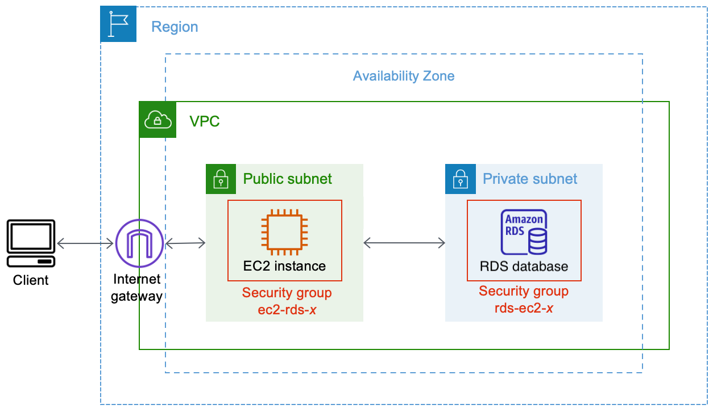
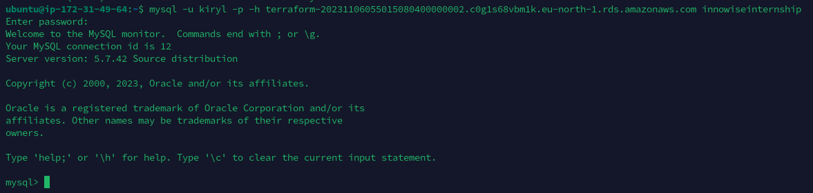

**Таска пустая, поэтому реализация связки EC2 & RDS по схеме из документации AWS**

### Схема:

<div style="text-align:center;">
  
</div>

Modules:
- [x] 1. Module [sg](./files/Task9.EC2/modules/sg/) - The official module from HashiCorp "SG"
- [x] 2. Module [vpc](./files/Task9.EC2/modules/vpc/) - The official module from HashiCorp "VPC"

Root directory (headers files):
- [x] File [main.tf](./files/Task9.EC2/) 
- [x] File [outputs.tf](./files/Task9.EC2/) 

<details>
<summary>View the <b>main.tf</b> file</summary>

```hcl
provider "aws" {
  region = "eu-north-1"
}

data "aws_vpc" "default" {
  default = true
}

data "aws_security_group" "default" {
  name   = "default"
  vpc_id = data.aws_vpc.default.id
}

data "aws_internet_gateway" "default" {
  filter {
    name   = "attachment.vpc-id"
    values = [aws_default_vpc.get.id]
  }
}

resource "aws_default_vpc" "get" {
  tags = {
    Name = "Default VPC"
  }
}

module "vpc" {
  source = "./modules/vpc"

  create_vpc = false

  azs = ["eu-north-1a"]

  public_gateway_id       = data.aws_internet_gateway.default.id
  public_vpc_id           = aws_default_vpc.get.id
  public_subnets          = ["172.31.49.0/24"]
  public_subnet_names     = ["Public Subnet #1"]
  public_route_table_tags = { "Name" = "Route table of public subnet" }
  map_public_ip_on_launch = true

  private_vpc_id           = aws_default_vpc.get.id
  private_subnets          = ["172.31.50.0/24"]
  private_subnet_names     = ["Private Subnet #1"]
  private_route_table_tags = { "Name" = "Route table of private subnet" }
}

module "ec2_rds" {
  source = "./modules/sg"

  name        = "ec2-rds-1"
  description = "Open traffic from all IPv4"
  vpc_id      = module.vpc.default_vpc_id

  ingress_cidr_blocks = ["0.0.0.0/0"]
  ingress_rules       = ["all-all"]

  egress_cidr_blocks = ["0.0.0.0/0"]
  egress_rules       = ["all-all"]
}

module "rds_ec2" {
  source = "./modules/sg"

  name        = "rds-ec2-1"
  description = "Open inbound traffic from EC2 to RDS"
  vpc_id      = module.vpc.default_vpc_id

  ingress_cidr_blocks = ["172.31.49.0/24"]
  ingress_rules       = ["mysql-tcp"]
}

module "db_computed_source_sg" {
  source = "./modules/sg"

  vpc_id = module.vpc.default_vpc_id

  name                = "RDS-EC2-1"
  ingress_cidr_blocks = ["172.31.49.0/24"]

  computed_ingress_with_source_security_group_id = [
    {
      rule                     = "mysql-tcp"
      source_security_group_id = module.ec2_rds.security_group_id
    }
  ]
  number_of_computed_ingress_with_source_security_group_id = 1
}

data "aws_ami" "getLatestUbuntu" {
  most_recent = true

  filter {
    name   = "name"
    values = ["ubuntu/images/hvm-ssd/ubuntu-jammy-22.04-amd64-server-*"]
  }

  owners = ["099720109477"]
}

resource "aws_instance" "public_instance" {
  ami           = data.aws_ami.getLatestUbuntu.id
  instance_type = "t3.micro"

  security_groups   = [module.ec2_rds.security_group_id]
  subnet_id         = module.vpc.public_subnets[0]
  key_name          = "khomenokkey"
  availability_zone = "eu-north-1a"

  tags = {
    Name = "Instance of T3.Micro in Public subnet"
  }
}

resource "aws_db_instance" "rds_instance" {
  vpc_security_group_ids = [module.db_computed_source_sg.security_group_id]
  instance_class         = "db.t3.micro"
  multi_az               = false
  publicly_accessible    = false
  availability_zone      = "eu-north-1a"

  engine            = "mysql"
  engine_version    = "5.7"
  allocated_storage = 10
  db_name           = "innowiseinternship"

  username = "kiryl"
  password = "PrivateDatabaseTryToConnect99612" // Just for test

  parameter_group_name = "default.mysql5.7"
  skip_final_snapshot  = true
}
```

</details> 
<br>

<details>
<summary>View the <b>outputs.tf</b> file</summary>

```hcl
output "rds_hostname" {
  value = aws_db_instance.rds_instance.address
}
```

</details> 
<br>

## Checking EC2 & RDS connection

<div style="text-align:center;">
  
</div>