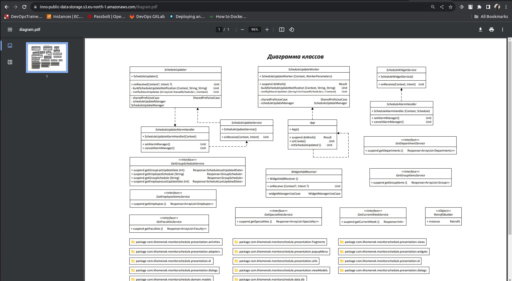

**Создание S3 Bucket и публичного доступа к его объектам, схемы нет, задания тоже**

Modules:
- [x] 1. Module [s3_object](./files/Task11/modules/s3_object/)

Root directory (headers files):
- [x] File [main.tf](./files/Task11/main.tf) 
- [x] File [variables.tf](./files/Task11/variables.tf) 

<details>
<summary>View the <b>main.tf</b> file</summary>

```hcl
provider "aws" {
  region = "eu-north-1"
}

resource "aws_s3_bucket" "public_data_storage" {
  bucket = "inno-public-data-storage"

  tags = { "Name" = "S3 Public Data Storage", "Environment" = "Prod" }
}

module "addObjects" {
  source = "./modules/s3_object"

  bucket       = aws_s3_bucket.public_data_storage.id
  key          = ["diagram.pdf"]
  sourceTo     = ["./S3-DataStorage/diagram.pdf"]
  content_type = ["application/pdf"]

  depends_on = [aws_s3_bucket.public_data_storage]
}

resource "aws_s3_bucket_ownership_controls" "objectWriter" {
  bucket = aws_s3_bucket.public_data_storage.id
  rule {
    object_ownership = "ObjectWriter"
  }

  depends_on = [aws_s3_bucket.public_data_storage]
}

resource "aws_s3_bucket_public_access_block" "this" {
  bucket = aws_s3_bucket.public_data_storage.id

  block_public_acls   = false
  block_public_policy = false

  depends_on = [aws_s3_bucket_ownership_controls.objectWriter]
}

resource "aws_s3_bucket_acl" "public_read" {
  bucket = aws_s3_bucket.public_data_storage.id
  acl    = "public-read"

  depends_on = [aws_s3_bucket_public_access_block.this]
}

resource "aws_s3_bucket_cors_configuration" "this" {
  bucket = aws_s3_bucket.public_data_storage.id

  cors_rule {
    allowed_headers = ["*"]
    allowed_methods = ["GET"]
    allowed_origins = ["https://inno-public-data-storage.s3.eu-north-1.amazonaws.com/*"]
    expose_headers  = [""]
    max_age_seconds = 3000
  }

  depends_on = [aws_s3_bucket_acl.public_read]
}

resource "aws_s3_bucket_policy" "this" {
  bucket = aws_s3_bucket.public_data_storage.id
  policy = var.bucket_policy

  depends_on = [aws_s3_bucket_cors_configuration.this]
}
```

</details> 
<br>

<details>
<summary>View the <b>variables.tf</b> file</summary>

```hcl
variable "bucket_policy" {
  default = <<EOF
{
    "Version": "2012-10-17",
    "Id": "PublicDataStoragePolicy",
    "Statement": [
        {
            "Sid": "PublicDataStorageStatement",
            "Effect": "Allow",
            "Principal": "*",
            "Action": [
                "s3:GetObject"
            ],
            "Resource": [
                "arn:aws:s3:::inno-public-data-storage/*"
            ]
        }
    ]
}
EOF
}
```

</details> 
<br>

## Checking static website on S3 Bucket

<div style="text-align:center;">
  
</div>