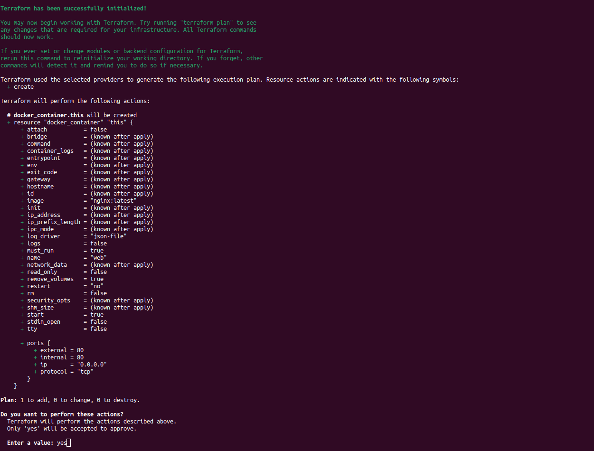
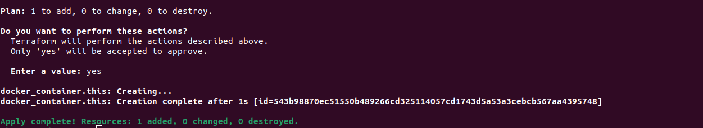
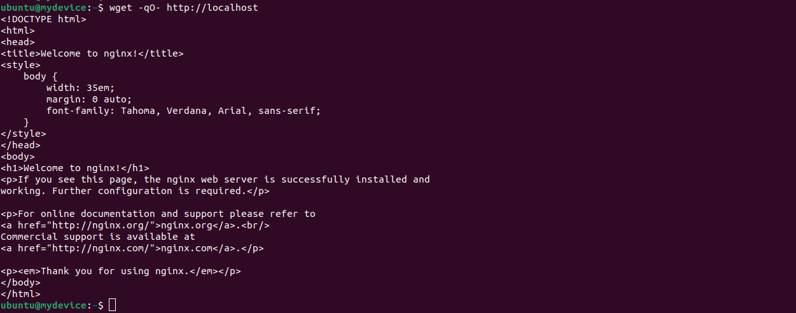

**1. Установка Docker. Источник: https://docs.docker.com/engine/install/ubuntu/**

```bash
# Add Docker's official GPG key:
sudo apt-get update
sudo apt-get install ca-certificates curl gnupg
sudo install -m 0755 -d /etc/apt/keyrings
curl -fsSL https://download.docker.com/linux/ubuntu/gpg | sudo gpg --dearmor -o /etc/apt/keyrings/docker.gpg
sudo chmod a+r /etc/apt/keyrings/docker.gpg

# Add the repository to Apt sources:
echo \
  "deb [arch="$(dpkg --print-architecture)" signed-by=/etc/apt/keyrings/docker.gpg] https://download.docker.com/linux/ubuntu \
  "$(. /etc/os-release && echo "$VERSION_CODENAME")" stable" | \
  sudo tee /etc/apt/sources.list.d/docker.list > /dev/null
sudo apt-get update

sudo apt-get install docker-ce docker-ce-cli containerd.io docker-buildx-plugin docker-compose-plugin
```

**2. Установка Terraform**

```bash
# Загрузка GPG ключа
wget -O- https://apt.releases.hashicorp.com/gpg | sudo gpg --dearmor -o /usr/share/keyrings/hashicorp-archive-keyring.gpg

# Добавление репозитория Terraform под ОС
echo "deb [signed-by=/usr/share/keyrings/hashicorp-archive-keyring.gpg] https://apt.releases.hashicorp.com $(lsb_release -cs) main" | sudo tee /etc/apt/sources.list.d/hashicorp.list

# Обновление списков пакетов, после чего установка Terraform
sudo apt update && sudo apt install terraform
```

**3. Создание директории для задачи и написание манифеста Terraform**

```bash
# Создание директории и переход в неё
mkdir /home/ubuntu/1064389-terraform-docker/ && cd /home/ubuntu/1064389-terraform-docker/

# Создание манифеста main.tf, редактирование и написание
nano main.tf
```
**4. Содержимое файла main.tf**

```hcl
terraform {
  required_providers {
    docker = {
      source  = "kreuzwerker/docker"
      version = "2.11.0"
    }
  }
}

provider "docker" {
  host = "unix:///var/run/docker.sock"
}

resource "docker_container" "this" {
  image = "nginx:latest"
  name  = "web"
  ports {
    internal = 80
    external = 80
  }
}

```

Для сохранения необходимо нажать Ctrl + O (сохранить файл), Enter (имя файла для сохранения, если нажать Enter, то имя не изменится), Ctrl + X (выйти)

**5. Создание скрипта sudo solve**

```bash
# Создание исполняемого файла "solve"
sudo nano /usr/local/bin/solve
```

Содержимое файла /usr/local/bin/solve/:

```bash
#!/bin/bash
cd /home/ubuntu/1064389-terraform-docker/
sudo terraform init && sudo terraform apply
```

**ВАЖНО!** Если команда `sudo solve` действительно должна выполнять сразу задачу, без подтверждения (в Terraform перед terraform apply всегда нужно ввести `yes`), то необходимо в содержимом файла /usr/local/bin/solve/ добавить в последней строчке `-auto-approve`, чтобы получилось:

```bash
#!/bin/bash
cd /home/ubuntu/1064389-terraform-docker/
sudo terraform init && sudo terraform apply -auto-approve
```

Для сохранения необходимо нажать Ctrl + O (сохранить файл), Enter (имя файла для сохранения, если нажать Enter, то имя не изменится), Ctrl + X (выйти)

**6. Проверка выполнения задачи. Выполняем команду `sudo solve` с любой директории**

```bash
# Переход в корневую директорию пользователя 'ubuntu'
cd ~

# Выполнение созданного скрипта
sudo solve
```

Выполнение sudo solve, необходимо написать `yes`, т.к. terraform дает планирование и выводит информацию по ресурсам, предварительно спрашивая, все ли верно. Скриншот ниже



Успешное выполнение sudo solve:



**7. Проверка работоспособности созданного контейнера, выполняя команду wget -qO- http://localhost**

```bash

# Отправка GET-запроса на указанный адрес, порт не пишется, потому что по протоколу HTTP стандартный 80, мы его и указали

# -q: Это опция "тихого режима" (quiet mode). Подавляет вывод информации о процессе загрузки и ошибок, в результате команда не будет выводить множество лишней информации в терминал, что полезно, если видеть информацию о процессе загрузки.

# -O-: В данном случае, -O- указывает на стандартный вывод (STDOUT).

wget -qO- http://localhost

<!DOCTYPE html>
<html>
<head>
<title>Welcome to nginx!</title>
<style>
    body {
        width: 35em;
        margin: 0 auto;
        font-family: Tahoma, Verdana, Arial, sans-serif;
    }
</style>
</head>
<body>
<h1>Welcome to nginx!</h1>
<p>If you see this page, the nginx web server is successfully installed and
working. Further configuration is required.</p>

<p>For online documentation and support please refer to
<a href="http://nginx.org/">nginx.org</a>.<br/>
Commercial support is available at
<a href="http://nginx.com/">nginx.com</a>.</p>

<p><em>Thank you for using nginx.</em></p>
</body>
</html>
```

Как видно из результата выполнения команды wget, мы успешно получили страницу приветствия nginx (GET-запрос). Скриншот:

